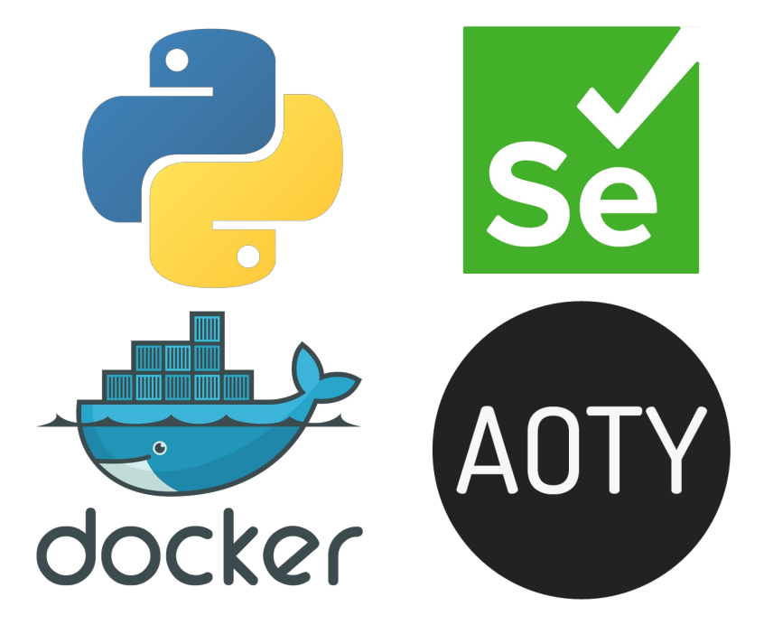
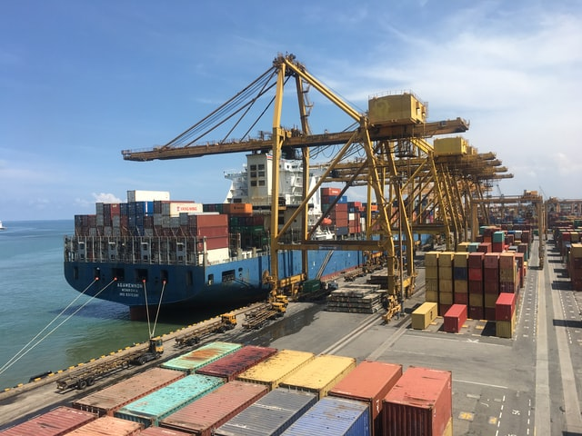
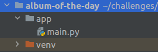

[Click here for post's source code](https://github.com/barrysweeney/1-click-startup/tree/master/guides-and-posts/album-of-the-day)

[Click here for part 2 of this series.](https://www.barrysweeney.com/aoty-guide-p2/)

In this tutorial you will learn how to find out which albums were released on a specific day. But you'll learn so much
more along the way...



You might be wondering

> *"Can I find out which albums were released on my birthday?"*

You sure can, **just read on to find out how.**

Also if you can relate to any of these then this guide is *definitely*
for you.

- If you want to learn some Docker and Selenium basics in a fun project before moving on to more complex Docker Compose
  and automated testing applications.
- If you're a new developer stuck in [tutorial purgatory](https://www.freecodecamp.org/news/escape-tutorial-purgatory/)
  who wants to wrap their head around more challenging concepts then you can go deeper down the rabbit hole by following
  the links throughout the guide.
- If you're a student or are learning to code and searching for a project to talk about in interviews to help get your
  foot through the door.

From [Docker](https://www.docker.com/why-docker):

> "Containers are a standardized unit of software that allows developers
> to isolate their app from its environment, solving the “it works on my
> machine” headache. For millions of developers today, Docker is the de
> facto standard to build and share containerized apps - from desktop,
> to the cloud."

From [Selenium](https://www.selenium.dev/):

> "Selenium automates browsers. That's it! What you do with that power
> is entirely up to you. Primarily it is for automating web applications
> for testing purposes, but is certainly not limited to just that.
> Boring web-based administration tasks can (and should) also be
> automated as well."

Looking for source code? \
[Jump to the Github Repo
**](https://github.com/barrysweeney/1-click-startup/tree/master/guides-and-posts/album-of-the-day)

Searching Album of The Year using Python, PySelenium, and Docker
================================================================

Firstly we'll setup our remote Selenium WebDriver with Docker run. This will save us from downloading the driver
ourselves and dealing with executable path configurations, or running our own Selenium server locally.

Next we'll tell our Python code how to access our driver.

Then we'll use the Python Selenium package to interact with
the [Album of the Year website](https://www.albumoftheyear.org/).

We'll wrap up with a discussion of our results and how we could take this further with a frontend interface.

- [Containerized Selenium Container](#selenium-container)
- [Configuring your development environment](#dev-env)
- [Project Structure](#project-structure)
- [Coding our PySelenium album searching bot](#coding)
- [Results from our PySelenium bot](#results)
- [What's Next?](#whats-next)
- [Troubleshooting](#troubleshooting)

Containerized Selenium webdriver?
---------------------------------



Photo
by [Nilantha Ilangamuwa](https://unsplash.com/@ilangamuwa?utm_source=unsplash&utm_medium=referral&utm_content=creditCopyText)
on
[Unsplash](https://unsplash.com/s/photos/container?utm_source=unsplash&utm_medium=referral&utm_content=creditCopyText)

We know we can [download the driver binaries](https://www.selenium.dev/documentation/en/webdriver/driver_requirements/)
and add executables to our PATH to access our webdriver via local host.
\
The question then becomes

> *Is there an easier way?*

Of course we
could [run a remote WebDriver server from the command line with a jar file](https://www.selenium.dev/documentation/en/remote_webdriver/remote_webdriver_server/)
, but we can also use [Docker Selenium](https://github.com/SeleniumHQ/docker-selenium).

Configuring your development environment
----------------------------------------

If you want to follow along to the tutorial you can take some time to setup your environment by installing Docker using
either of these guides

- [Install Docker Engine on Linux](https://docs.docker.com/engine/install/)
- [Install Docker Desktop on Mac](https://docs.docker.com/docker-for-mac/install/)
- [Install Docker Desktop on Windows](https://docs.docker.com/docker-for-windows/install/)

Either will help you set up the required software for this tutorial.

Project Structure
-----------------

Let's review our directory structure before we go any further. You can always refer to
the [source code](https://github.com/barrysweeney/1-click-startup/tree/master/guides-and-posts/album-of-the-day)
too.

Now let's look at the project:



As we can see, we're not dealing with anything too complicated here so it should be a nice project to get up and running
with if you're new to PySelenium (or just really want to know what albums were released on your birthday).

Let's get to work.

Programming our PySelenium album searching bot
----------------------------------------------

We can now move on to programming our PySelenium bot to interact with the Album of The Year site via a Dockerized
Selenium WebDriver.

I like to start by creating a new Python project with a Virtual Environment in PyCharm but you can use any IDE or text
editor you prefer. You can set up your own environment if your editor doesn't automatically configure it for you by
executing the command `venv`:

                python3 -m venv /path/to/new/virtual/environment

For more info you can check out the [official Python documentation on venv](https://docs.python.org/3/library/venv.html)

Note that you may need to change `python3` to `python` depending on which version you have installed.

We'll start by installing selenium and requests

    pip3 install selenium
    pip3 install requests

Note that you may need to change `pip3` to `pip` depending on which version you have installed.

Now we can import our required packages.

```python
from selenium import webdriver
from selenium.common.exceptions import NoSuchElementException, StaleElementReferenceException
import time
import os
import requests
```

Notable imports include:

- **selenium.common.exceptions** - we can catch these exceptions to retry actions in the UI
- **os** - we can use this to initiate our `docker run` command

Let's move on to starting our Selenium webdriver container

```python
os.system(
    'sudo docker run --name my-selenium-container -d -p 4444:4444 -v /dev/shm:/dev/shm selenium/standalone-firefox:4.0.0-beta-1-prerelease-20210210')
```

This command starts a standalone Firefox container. For other browsers and a description of why `-v /dev/shm:/dev/shm `
is necessary you can visit the [Docker Selenium Page](https://github.com/SeleniumHQ/docker-selenium#standalone).

We've named the container "my-selenium-container" so we can remove it at the end of our program.

Excuse the following wall of code but it's actually very important. When we start our container we need to wait for it
to be in a state where it's ready to provide the services we need to use it as our remote webdriver.

```python
ready = False
time.sleep(5)
while not ready:
    try:
        r = requests.get('http://localhost:4444/wd/hub/status', timeout=1)
        status = r.status_code
        if status == 200:
            ready = True
    except ConnectionResetError or ConnectionError:
        continue
```

Essentially, we keep hitting the status endpoint until it says it's ready and then we can move on with the rest of our
Python script.

```python
driver = webdriver.Remote(desired_capabilities=webdriver.DesiredCapabilities.FIREFOX,
                          command_executor="http://localhost:4444/wd/hub")
```

We can connect to our remote webdriver on localhost since due to the docker run command `-p 4444:4444` which maps port
4444 of the container to port 4444 of our local machine.

Next we'll hard code some searching and filtering parameters, we'll see alternatives to this approach in our concluding
discussion.

```python
month_name = 'june'
month_code = '06'
month_name_short = 'Jun'
year = '1999'
day_of_month = '1'
release_date_to_search = '%s %s' % (month_name_short, day_of_month)
```

Why this date? Because it's your birthday (there's a ≅1.42857142857e-10 chance it is. My favourite album was released
this day actually).

We can tell our driver to head over to [Album of The Year](https://www.albumoftheyear.org) and to the release page for
all the albums released in the month we hardcoded.

```python
driver.get("https://www.albumoftheyear.org/%s/releases/%s-%s.php?s=release&genre=all" % (year, month_name, month_code))
```

Next we'll code our PySelenium bot to keep clicking the button to load more albums.

```python
all_albums_loaded = False

while not all_albums_loaded:
    try:
        show_more_button_container = driver.find_element_by_class_name('showMore')
        time.sleep(3)
        driver.execute_script("arguments[0].click();",
                              show_more_button_container.find_element_by_class_name('largeButton'))
        time.sleep(1)
```

Note we're using the `execute_script` method as opposed to the `click()` method of the `WebElement`
object returned by `find_element_by_id`\
We do this because another element is covering the show more button. You can
see [this StackOverflow answer by user RemcoW](https://stackoverflow.com/a/37880313/9472445) for more details and an
explanation of `arguments[0]`

We're not quite finished with this while loop just yet, we need to do two things:

- **except StaleElementReferenceException** - our WebElement can be destroyed and re-rendered in the DOM so we'll need
  to retry by using
  `continue` if our reference becomes
  stale. [This StackOverflow answer by user Ardesco](https://stackoverflow.com/a/16244739/9472445) describes the
  situation more clearly.
- **except NoSuchElementException** - tell our bot they can stop trying to click the button now, it isn't being rendered
  to the UI so all albums are on the page.

For completeness, this is our complete while loop

```python
while not all_albums_loaded:
    try:
        show_more_button_container = driver.find_element_by_class_name('showMore')
        time.sleep(3)
        driver.execute_script("arguments[0].click();",
                              show_more_button_container.find_element_by_class_name('largeButton'))
        time.sleep(1)
    except StaleElementReferenceException:
        continue
    except NoSuchElementException:
        all_albums_loaded = True
```

We can store all albums being displayed in a variable now so we can easily iterate through them.

```python
albums = driver.find_elements_by_class_name('albumBlock')
```

Let's do just that

```python
for album in albums:
    album_release_date = album.find_element_by_class_name('date').text
    if album_release_date == release_date_to_search:
        album_title = album.find_element_by_class_name('albumTitle').text
        artist_title = album.find_element_by_class_name(
            'artistTitle').text
        print('%s - %s' % (album_title, artist_title))
```

This is really our main block of code. We iterate through each album and print out it's title and artist if it was
released on the day we have specified to search for.

Last but not least we can do a little housekeeping by closing our driver's window and removing our Selenium container

```python
driver.close()

os.system(
    'sudo docker rm -f my-selenium-container')
```

Congrats! Now let's see the results of our hard work in the next section.

Results of our PySelenium AOTY searching bot
--------------------------------------------

Let's open a terminal in our project directory (for me that's album-of-the-day/app) and enter the following command

    python3 main.py

If you've followed along and used `sudo` in the docker run command you'll be prompted for your password and then the
results will begin to pour in...

    < Selenium Container ID >
    Enema of the State - Blink-182
    Play - Moby
    On the 6 - Jennifer Lopez
    No Angel - Dido
    Doors Open At 8am - Merzbow
    Venni Vetti Vecci - Ja Rule
    Very Emergency - The Promise Ring
    Panzer Division - Marduk
    Straight Ahead - Pennywise
    Who Needs Pictures - Brad Paisley
    Last Wave Rockers - Common Rider
    Bad Love - Randy Newman
    The Broken Down Comforter Collection - Grandaddy
    Here Comes the Bride - Spin Doctors
    Door Open at 8 AM - Merzbow
    Criteria for a Black Widow - Annihilator
    Ryo Fukui in New York - Ryo Fukui
    The Mirror Man Sessions - Captain Beefheart
    Épisode sanglant - Les Marmottes Aplaties
    Barefoot on the Beach - Michael Franks
    Failures for Gods - Immolation
    A Tear For The Ghetto - Group Home
    Short Music for Short People - Various Artists
    Sorrow - Baek Jiyoung
    Lauwarm Instrumentals - Scanner
    Lonely Grill - Lonestar
    Calamine - Calamine
    Da Crime Family - TRU
    Shrinking Violet - L.A. Guns
    The Song of Bernadette (Original Soundtrack) - Alfred Newman
    Learning Curve - DJ Rap
    Pictures of the Big Vacation - Mike Errico
    A Night to Remember - Joe Diffie
    In the New Old-Fashioned Way - Fluid Ounces
    Technical Difficulties - Hate Dept.
    Blaque - Blaque
    Metropolis Blue - Jack Lukeman
    The Quiet Table - Three Fish
    Brighter Days - Curtis Stigers
    Pop Loops for Breakfast - B. Fleischmann
    Praises - Shinehead
    Hercules: The Legendary Journeys, Vol. 3 - Joseph LoDuca
    Backs N' Necks - Neek The Exotic & Large Professor
    So Anxious - Ginuwine
    The Ultimate Collection - Delbert McClinton
    Race for the Prize - The Flaming Lips
    Deep and Warm - Twisted Science
    my-selenium-container

What's Next?
------------

Remember you
can [grab the source code](https://github.com/barrysweeney/1-click-startup/tree/master/guides-and-posts/album-of-the-day)
so you can take this and run with it adapting it however you like, read on to find out what my plans are for this
project and ideas about where this could go next.

I was motivated to create this project because I couldn't find a site that could be used to search for albums by a
specific release date. I'll be designing the frontend for this program in
an [upcoming post](../../guide-pt-2/aoty-guide-p2/index.html) and showing how you can deploy it so you can use and share
it with others.

[Click here for part 2 of this series.](https://www.barrysweeney.com/aoty-guide-p2/)

Stay tuned to [my blog](https://www.barrysweeney.com/blog/), you don't want to miss out!

Bonus: Troubleshooting
----------------------

Here's some resources for resolving common errors you might run into along the way in this guide or in your own
explorations.

- `requests.exceptions.ConnectionError: ('Connection aborted.', ConnectionResetError(104, 'Connection reset by peer'))`
    - this is a common error coined [The Python "Connection Rest By Peer"
      Problem](http://www.itmaybeahack.com/homepage/iblog/architecture/C551260341/E20081031204203/index.html). You can
      read more about it in [this StackOverflow post by user S.Lott](https://stackoverflow.com/a/383816/9472445). In our
      case it will likely arise from trying to access the status endpoint of the Selenium container before the container
      is ready. You can use
      `time.sleep(1)` before making a request to
      `http://localhost:4444/wd/hub/status` and adjusting the time to fit your needs.
- `pip: command not found` - this is likely a problem relating to your environment as described (along with solutions)
  in
  [this post by James Gallagher on Career Karma](https://careerkarma.com/blog/python-pip-command-not-found/). It may be
  as simple as changing `pip` to `pip3` or you may need to actually install pip3, for example with apt-get
  `sudo apt-get -y install python3-pip`
- `StaleElementReferenceException` - our WebElement can be destroyed and re-rendered in the DOM so we'll need to retry
  by using `continue` if our reference becomes
  stale. [This StackOverflow answer by user Ardesco](https://stackoverflow.com/a/16244739/9472445) describes the
  situation more clearly. We can catch this exception in an
  `except` block and tell our code to retry a certain operation until the exception doesn't occur. You can see
  [the example we've used in this guide](#stale-element) where our solution was to use the `continue` keyword inside
  a `while` loop.
- `Element is not clickable at point (x,y) because another element obscures             it`
    - You can see [this StackOverflow answer by user RemcoW](https://stackoverflow.com/a/37880313/9472445) for more
      details and an explanation of our solution in this guide which was to use
      `driver.execute_script("arguments[0].click();", element)`
      as opposed to the `click()` method of the
      `WebElement` object returned by
      `find_element_by_id`
- `Failed to connect to localhost port 4444: Connection refused`
    - If you're planning to access the Selenium webdriver endpoint from within a different Docker container you can
      change
      `http://localhost:4444/wd/hub` to `http://172.17.0.1:4444/wd/hub` or
      `http://host.docker.internal:4444/wd/hub`. The rationale behind this is provided
      in [this StackOverflow answer by user devnev](https://stackoverflow.com/a/48547074/9472445).

