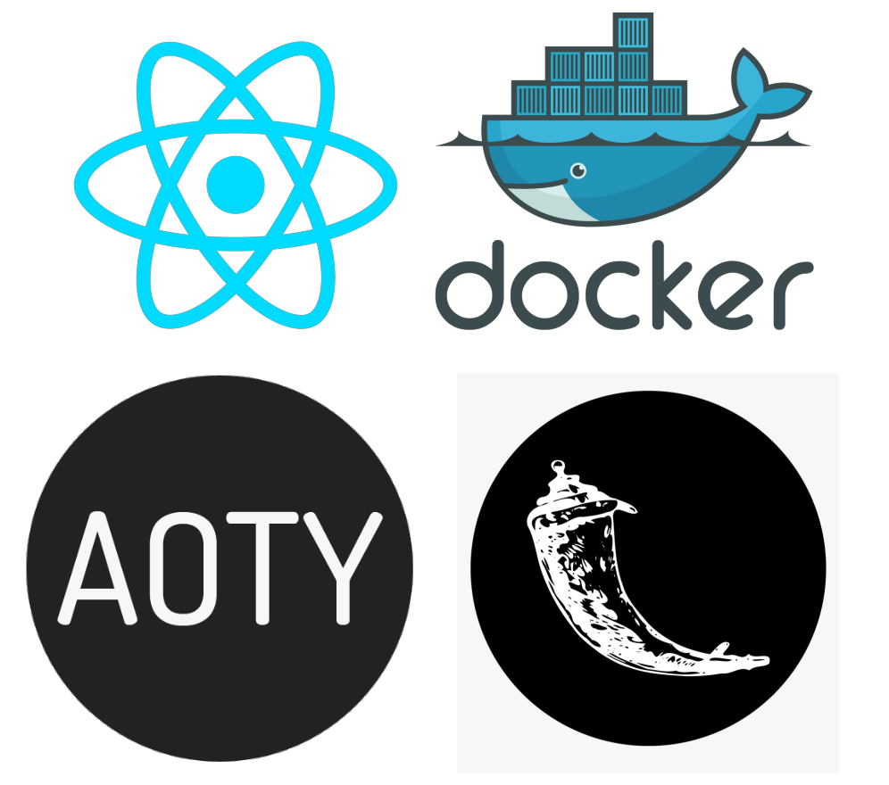
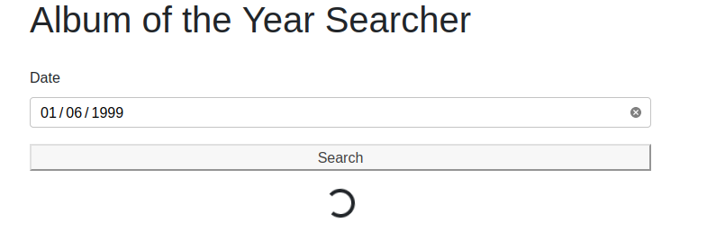
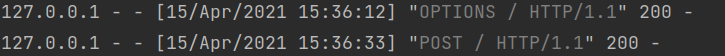
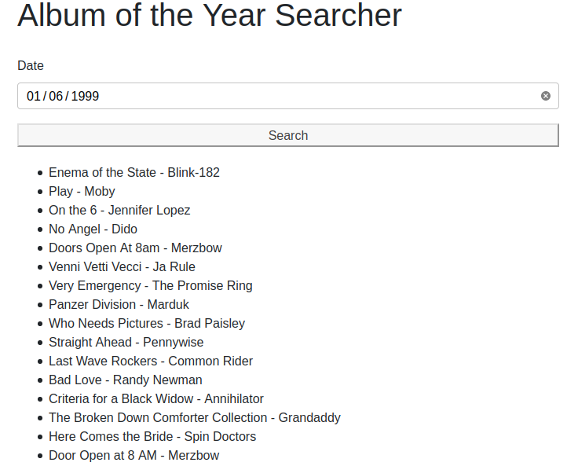

[Click here for post's source code](https://github.com/barrysweeney/1-click-startup/tree/master/developer/guides-and-posts/social-media-post/guide-pt-2)

[Click here for part 1 of this series.](https://www.barrysweeney.com/aoty-guide-p1/)

In this tutorial we'll design an app to find out which albums were released on a specific day. But you'll learn so much
more along the way...



In [part 1](https://www.barrysweeney.com/aoty-guide-p1/) we answered the question

> *"Can I find out which albums were released on my birthday?"*

You sure can, **just read on to find out how.**

In [part 1 of this guide](https://www.barrysweeney.com/aoty-guide-p1/) we brought up that if you can relate to any of
these then you're
*definitely* in the right place.

- If you want to learn some Docker and Selenium basics in a fun project before moving on to more complex Docker Compose
  and automated testing applications.
- If you're a new developer stuck in [tutorial purgatory](https://www.freecodecamp.org/news/escape-tutorial-purgatory/)
  who wants to wrap their head around more challenging concepts, then you can go deeper down the rabbit hole by following
  the links throughout the guide.
- If you're a student or are learning to code and searching for a project to talk about in interviews to help get your
  foot through the door.

In this guide, the same applies, *and* in addition, this guide is
*absolutely* for you if you're interested in any of these.

- Creating a custom frontend with the JavaScript framework React.
- Adapting a Python console app into a Flask webserver.

From [ReactJS](https://reactjs.org/):

> A JavaScript library for building user interfaces

From [Python Basic - What is Flask Python?](https://pythonbasics.org/what-is-flask-python/):

> "Flask is a web application framework written in Python. A Web
> Application Framework or simply a Web Framework represents a
> collection of libraries and modules that enable web application
> developers to write applications without worrying about low-level
> details"

Looking for source code? \
[Jump to the Github Repo
**](https://github.com/barrysweeney/1-click-startup/tree/master/developer/guides-and-posts/social-media-post/guide-pt-2)

Searching Album of The Year using Flask, Selenium, Docker, and React
====================================================================

Firstly, we'll use create-react-app to generate the template for our frontend.

Next, we'll customize our frontend interface and set up the functions that send requests to our Flask webserver.

Then, we'll adapt our Python console app into a Flask webserver.

We'll wrap up with a discussion of our results and how we could take this further.

- [Configuring your development environment](#configuring-your-development-environment)
- [React Frontend](#react-frontend)
- [Flask Webserver Backend](#flask-webserver-backend)
- [Results](#results)
- [What's Next?](#whats-next)
- [Troubleshooting](#bonus-troubleshooting)

Configuring your development environment
----------------------------------------

If you want to follow along with the tutorial you can take some time to set up your environment by installing Docker
using either of these guides

- [Install Docker Engine on Linux](https://docs.docker.com/engine/install/)
- [Install Docker Desktop on Mac](https://docs.docker.com/docker-for-mac/install/)
- [Install Docker Desktop on Windows](https://docs.docker.com/docker-for-windows/install/)

Either will help you set up the required software for this tutorial.

In addition to Docker, you'll also need [NodeJs](https://nodejs.org/en/)
which you can install with either of these guides

- [Install NodeJS on Ubuntu](https://www.digitalocean.com/community/tutorials/how-to-install-node-js-on-ubuntu-18-04)
- [Install NodeJS on Mac](https://www.fosstechnix.com/install-node-js-on-mac/)
- [Install NodeJS on Windows](https://www.fosstechnix.com/how-to-install-node-js-on-windows/)

You can now move on to creating our React app.

React Frontend
--------------

First we can start with a
generated [single-page application](https://reactjs.org/docs/glossary.html#single-page-application)
with the help of `create-react-app`

```shell
npx create-react-app aoty-frontend
cd aoty-frontend
npm start
```

`npx` is the package runner tool that comes with npm which is the node package manager installed along with NodeJS.

The generated app will now be in the folder `aoty-frontend` which I would now recommend opening with your IDE/text
editor of choice.

We'll start be rewriting `src/App.js`. We can change the `App()`
function to

```jsx
function App() {
  return (
    <div></div>
  );
}
```

Now we can add a heading, and the basic html for the form

```jsx
<div>
  <h1>Album of the Year Searcher</h1>
  <form action="#">
    <label>
      Date
      <input type="date" name="date" id="date" />
    </label>
    <button type="submit" id="submit-date">Search</button>
  </form>
</div>
```

Now, under the form we want to add a loading spinner if the app is in the state of searching for albums.

```jsx
{
  this.state.searching ?
    <div className="text-center">
      <div className="spinner-border" role="status">
        <span className="sr-only">Loading...</span>
      </div>
    </div>
    : null
}
```

The class names are actually Bootstrap specific - which is a CSS framework for developing responsive sites.

We'll return to Bootstrap later, but for now, we'll want a way to display the albums our search found. Just under the
previous code we can map the results returned from our search to list item elements.

```jsx
{
  this.state.results.length !== 0 ? (
    <ul>{
      this.state.results.map((result, i) =>
        <li key={i}>{result}</li>
      )
    }</ul>
  ) : null
}
```

We'll want to take the form submission into our own hands next and add a little styling

```jsx
<form onSubmit={this.submitHandler.bind(this)} action="#" style={{ display: `grid`, gap: `10px` }}>
```

We'll change the `App` function to a class now, here's where we're at now, also note the new import

```jsx
import React, { Component } from "react"

class App extends Component {
  constructor(props) {
    super(props);
    this.state = {
      results: [],
      searching: false,
    };
  }

  render() {
    return (
      <div>
        ...
      </div>
    )
  }
}
```

Now we can add the `submitHandler` function that is called on form submission

```jsx
async
submitHandler(e)
{
  // Prevent browser's default form submission behaviour
  e.preventDefault()
  // Extract date from form and split into array
  const date = e.target.date.value.split("-")
  // Store year, month code, and formatted day from date array
  const year = date[0]
  const monthCode = date[1]
  const day = parseInt(date[2], 10) // 01 becomes 1, etc.

  // Create request body
  const body = {}
  body.day = day
  body.month_code = monthCode
  body.year = year

  // Set searching to true to display loading spinner
  this.setState({
    searching: true,
  })

  // Send POST request to backend and await a response
  const response = await fetch(`http://localhost:5000/`, {
    method: "POST",
    headers: {
      "Content-Type": "application/json"
    },
    body: JSON.stringify(body)
  })
  // If the response is OK then set state to display albums
  if (response.status === 200) {
    const data = await response.json();
    this.setState({
      results: data.results,
      searching: false,
    })
  }
}
```

That's essentially all the work done on the frontend, we can just add some styling now with Bootstrap

As we mentioned earlier... From [w3schools - What is Bootstrap?]():

> "Bootstrap is the most popular CSS Framework for developing responsive
> and mobile-first websites."

We can open the `aoty-frontend` folder in the terminal and run

    npm install react-bootstrap bootstrap

Inside the `<head>` tag of `public/index.html` we can include the Bootstrap CDN link

```jsx
<head>
  ...
  <link
    rel="stylesheet"
    href="https://cdn.jsdelivr.net/npm/bootstrap@4.6.0/dist/css/bootstrap.min.css"
    integrity="sha384-B0vP5xmATw1+K9KRQjQERJvTumQW0nPEzvF6L/Z6nronJ3oUOFUFpCjEUQouq2+l"
    crossorigin="anonymous"
  />
  ...
</head>
```

And in either `src/index,js` or `src/App.js` we can include the following line

```jsx
import 'bootstrap/dist/css/bootstrap.min.css';
```

Now we can head back to `src/App.js` and at the top of the file add

```jsx
import Container from 'react-bootstrap/Container'
```

We'll use Bootstrap and CSS Grid to customise what our App renders now

```jsx
render()
{
  return (
    <Container>
      <div style={{ display: `grid`, gap: `20px` }}>
        <h1>Album of the Year Searcher</h1>
        <form onSubmit={this.submitHandler.bind(this)} action="#" style={{ display: `grid`, gap: `10px` }}>
          ...
        </form>
        ...
      </div>
    </Container>
  )
}
```

We can now move on to programming our Flask backend.

Flask webserver backend
-----------------------

We're essentially rewriting the code from [part 1](https://www.barrysweeney.com/aoty-guide-p1/) of the guide, but I'll go
over the code here too, so it isn't required you've read the first installment.

A quick way to get up and running is to create a new directory on the terminal with `mkdir` and open it with VS Code

    sudo mkdir aoty-flask-backend
    code aoty-flask-backend    

We can create a virtual environment within the `aoty-flask-backend`
folder then (I like to open the VS Code terminal with `` ctrl+alt+` ``)

    python3 -m venv .venv

And we can activate the environment with

     source .venv/bin/activate

For more info you can check out the [official Python documentation on venv](https://docs.python.org/3/library/venv.html)

Note that you may need to change `python3` to `python` depending on which version you have installed.

Next we'll install the necessary packages to get up and running

    pip3 install requests flask selenium flask_cors

Now we can import the packages

```python
# For handling requests and responses
import requests
import json
from flask import Flask, request
# Selenium imports
from selenium import webdriver
from selenium.common.exceptions import NoSuchElementException, \
    StaleElementReferenceException
import time
# To run Docker commands
import os
# To enable requests from the frontend user interface
from flask_cors import CORS, cross_origin
```

We then create and configure the app

```python
# Create Flask instance
app = Flask(__name__)
```

From [Flask - Application Setup](https://flask.palletsprojects.com/en/1.1.x/tutorial/factory/):

> `__name__` is the name of the current Python module. The app needs to
> know where it’s located to set up some paths, and `__name__` is a
> convenient way to tell it that.

Next, we use the `flask_cors` module to allow communication between our frontend interface and backend webserver.

```python
# Enable CORS to permit requests from the frontend to the backend (a different origin)
CORS(app) # Enables CORS for all routes
# Allow Content-Type header
app.config['CORS_HEADERS'] = 'Content-Type'
```

From [MDN Web Docs - CORS](https://developer.mozilla.org/en-US/docs/Web/HTTP/CORS):

> **Cross-Origin Resource Sharing** (CORS) is an HTTP-header based
> mechanism that allows a server to indicate any other origins (domain,
> scheme, or port) than its own from which a browser should permit
> loading of resources

Next, we'll start the Selenium Docker container

```python
# Start Selenium webdriver container
os.system(
    'sudo docker run --name my-selenium-container -d -p 4444:4444  -v /dev/shm:/dev/shm selenium/standalone-firefox:4.0.0-beta-1-prerelease-20210210')
```

This command starts a standalone Firefox container. For other browsers and a description of why `-v /dev/shm:/dev/shm `
is necessary you can visit the [Docker Selenium Page](https://github.com/SeleniumHQ/docker-selenium#standalone).

Now we'll work on our one and only route. First we'll just get data from the form and format it

```python
@app.route('/', methods=['POST'])
@cross_origin()
def search_albums():
    # Get data from form
    data = request.json
    day = data['day']
    month_code = data['month_code']
    year = data['year']
    month = ''
    month_name_short = ''

    # Set month and month_name_short based on month_code
    if month_code == '01':
        month = 'january'
        month_name_short = 'Jan'
    elif month_code == '02':
        month = 'february'
        month_name_short = 'Feb'
    elif month_code == '03':
        month = 'march'
        month_name_short = 'Mar'
    elif month_code == '04':
        month = 'april'
        month_name_short = 'Apr'
    elif month_code == '05':
        month = 'may'
        month_name_short = 'May'
    elif month_code == '06':
        month = 'june'
        month_name_short = 'Jun'
    elif month_code == '07':
        month = 'july'
        month_name_short = 'Jul'
    elif month_code == '08':
        month = 'october'
        month_name_short = 'Aug'
    elif month_code == '09':
        month = 'september'
        month_name_short = 'Sep'
    elif month_code == '10':
        month = 'october'
        month_name_short = 'Oct'
    elif month_code == '11':
        month = 'november'
        month_name_short = 'Nov'
    elif month_code == '12':
        month = 'december'
        month_name_short = 'Dec'

    # Format release date to search for like "Sep 20"
    release_date_to_search = '%s %s' % (month_name_short, day)
```

This command starts a standalone Firefox container. For other browsers and a description of why `-v /dev/shm:/dev/shm `
is necessary you can visit the [Docker Selenium Page](https://github.com/SeleniumHQ/docker-selenium#standalone).

The next piece of code is actually very important. When we start our container we need to wait for it to be in a state
where it's ready to provide the services we need to use it as our remote webdriver.

```python
ready = False
time.sleep(5)
while not ready:
    try:
        r = requests.get('http://localhost:4444/wd/hub/status', timeout=1)
        status = r.status_code
        if status == 200:
            ready = True
    except ConnectionResetError or ConnectionError:
        continue
```

Essentially, we keep hitting the status endpoint until it says it's ready, and then we can move on with the rest of our
Python script. Now we can connect to the remote Firefox webdriver

```python
# Connect to remote Firefox webdriver
driver = webdriver.Remote(desired_capabilities=webdriver.DesiredCapabilities.FIREFOX,
                          command_executor="http://localhost:4444/wd/hub")
```

We can connect to our remote webdriver on localhost since due to the docker run command `-p 4444:4444` which maps port
4444 of the container to port 4444 of our local machine.

And go to the AOTY page for the specified month

```python
# Go to Album of the Year page for specific month
driver.get(
        "https://www.albumoftheyear.org/%s/releases/%s-%s.php?s=release&genre=all" % (year, month, month_code))
```

Next, we'll code our PySelenium bot to keep clicking the button to load more albums.

```python
all_albums_loaded = False

while not all_albums_loaded:
    try:
        show_more_button_container = driver.find_element_by_class_name('showMore')
        time.sleep(3)
        driver.execute_script("arguments[0].click();",
                              show_more_button_container.find_element_by_class_name('largeButton'))
        time.sleep(1)
```

Note we're using the `execute_script` method as opposed to the `click()` method of the `WebElement`
object returned by `find_element_by_id`\
We do this because another element is covering the show more button. You can
see [this StackOverflow answer by user RemcoW](https://stackoverflow.com/a/37880313/9472445) for more details and an
explanation of `arguments[0]`

We're not quite finished with this while loop just yet, we need to do two things:

- **except StaleElementReferenceException** - our WebElement can be destroyed and re-rendered in the DOM, so we'll need
  to retry by using
  `continue` if our reference becomes
  stale. [This StackOverflow answer by user Ardesco](https://stackoverflow.com/a/16244739/9472445) describes the
  situation more clearly.
- **except NoSuchElementException** - tell our bot they can stop trying to click the button now, it isn't being rendered
  to the UI so all albums are on the page.

For completeness, this is our complete while loop

```python
while not all_albums_loaded:
    try:
        show_more_button_container = driver.find_element_by_class_name('showMore')
        time.sleep(3)
        driver.execute_script("arguments[0].click();",
                              show_more_button_container.find_element_by_class_name('largeButton'))
        time.sleep(1)
    except StaleElementReferenceException:
        continue
    except NoSuchElementException:
        all_albums_loaded = True
```

We can store all albums being displayed in a variable now, so we can easily iterate through them.

```python
albums = driver.find_elements_by_class_name('albumBlock')
```

Let's do just that

```python
response = []
# For each album, if the release date matches the date to search for then append it to the response array
for album in albums:
    album_release_date = album.find_element_by_class_name('date').text
    if album_release_date == release_date_to_search:
        album_title = album.find_element_by_class_name('albumTitle').text
        artist_title = album.find_element_by_class_name(
            'artistTitle').text
        response.append('%s - %s' % (album_title, artist_title))
```

This is really our main block of code. We iterate through each album and append to our `response` array it's title and
artist if it was released on the day we have specified to search for.

We can do a little housekeeping by returning a message if no albums match the release date and closing our driver
connection

```python
# If no albums are found return a message informing the user
if len(response) == 0:
    response.append('No albums found')

# Close connection to Firefox webdriver
driver.close()
```

Finally, we'll return our response to the user

```python
# Return response to user
return json.dumps({'results': response}), 200, {'ContentType': 'application/json'}
```

And we'll provide the command to run our Flask app outside the function

```python
if __name__ == '__main__':
    app.run()
```

Congrats! Now let's see the results of our hard work in the next section.

You can find all the source code for this guide
[here.](https://github.com/barrysweeney/1-click-startup/tree/master/developer/guides-and-posts/social-media-post/guide-pt-2)

Results
-------

Let's try searching for the albums released on a certain date to see our results.

Inside the virtual environment, we can run

    python3 app.py

to start our webserver

If you've followed along and used `sudo` in the docker run command you'll be prompted for your password, and then we can
move to our frontend application and restart the server (hint: `ctrl+c` and `npm start`) which can be accessed
at <http://localhost:3000>

Now we can enter a date and search



We can see the request has been successful on the backend



And the results come back to the user on the frontend



What's Next?
------------

Remember you
can [grab the source code](https://github.com/barrysweeney/1-click-startup/tree/master/developer/guides-and-posts/social-media-post/guide-pt-2)
so you can take this and run with it adapting it however you like, read on to find out what my plans are for this
project and ideas about where this could go next.

We can improve our frontend by designing with our users in mind with an interface integrating the album covers, and we
could even add filtering by genre.

Another possible challenge to take on would be deployment using services such as [Heroku](https://www.heroku.com/) and
[Netlify](https://www.netlify.com/).

Stay tuned to [my blog](https://www.barrysweeney.com/blog/), you don't want to miss out!

Bonus: Troubleshooting
----------------------

Here are some resources for resolving common errors you might run into along the way in this guide or in your own
explorations.

- `requests.exceptions.ConnectionError: ('Connection aborted.', ConnectionResetError(104, 'Connection reset             by peer'))`

    - this is a common error coined [The Python "Connection Rest By Peer"
      Problem](http://www.itmaybeahack.com/homepage/iblog/architecture/C551260341/E20081031204203/index.html). You can
      read more about it in [this StackOverflow post by user S.Lott](https://stackoverflow.com/a/383816/9472445). In our
      case it will likely arise from trying to access the status endpoint of the Selenium container before the container
      is ready. You can use
      `time.sleep(1)` before making a request to
      `http://localhost:4444/wd/hub/status` and adjusting the time to fit your needs.
- `pip: command not found` - this is likely a problem relating to your environment as described (along with solutions)
  in
  [this post by James Gallagher on Career Karma](https://careerkarma.com/blog/python-pip-command-not-found/). It may be
  as simple as changing `pip` to `pip3` or you may need to actually install pip3, for example with apt-get
  `sudo apt-get -y install python3-pip`
- `StaleElementReferenceException` - our WebElement can be destroyed and re-rendered in the DOM, so we'll need to retry
  by using `continue` if our reference becomes
  stale. [This StackOverflow answer by user Ardesco](https://stackoverflow.com/a/16244739/9472445) describes the
  situation more clearly. We can catch this exception in an
  `except` block and tell our code to retry a certain operation until the exception doesn't occur. You can see the
  example we've used in this guide where our solution was to use the `continue`
  keyword inside a `while` loop.
- `Element is not clickable at point (x,y) because another element obscures it`
    - You can see [this StackOverflow answer by user RemcoW](https://stackoverflow.com/a/37880313/9472445) for more
      details, and an explanation of our solution in this guide which was to use
      `driver.execute_script("arguments[0].click();", element)` as opposed to the `click()`
      method of the
      `WebElement` object returned by
      `find_element_by_id`
- `Failed to connect to localhost port 4444: Connection refused`
    - If you're planning to access the Selenium webdriver endpoint from within a different Docker container you can
      change
      `http://localhost:4444/wd/hub` to `http://172.17.0.1:4444/wd/hub` or
      `http://host.docker.internal:4444/wd/hub`. The rationale behind this is provided
      in [this StackOverflow answer by user devnev](https://stackoverflow.com/a/48547074/9472445).
- `requests.exceptions.ConnectionError: HTTPConnectionPool(host='localhost', port=4444): Max retries exceeded with url: /wd/hub/status`

    - to solve this error you should run
      `sudo             docker rm -f my-selenium-container`

