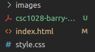
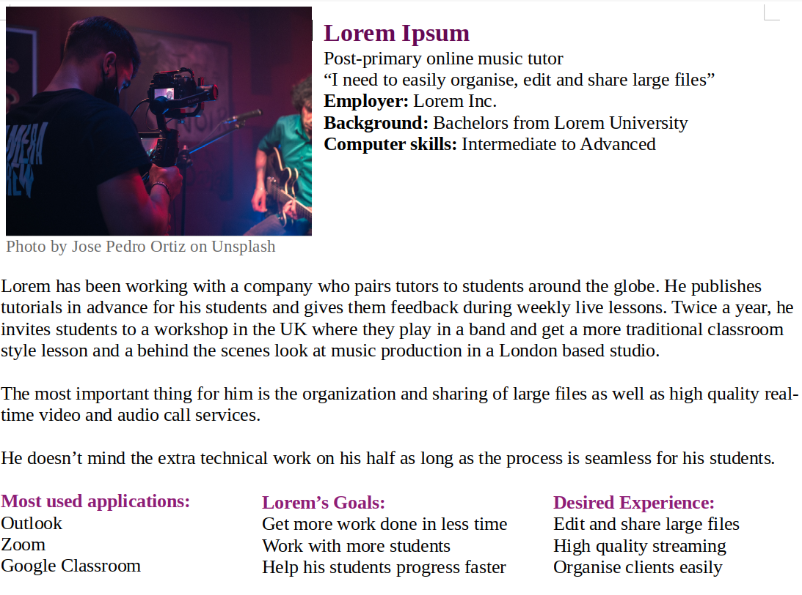

[Click here for post's source code](#)



In this tutorial you will learn how to ...


You might be asking

> "Hi - How do we do X? Is it possible?"

Sure is, **just read on to find out**.

Looking for source code?

[Jump to downloads section ->](#)

## Repeat the heading again here

We'll do A in the first part.

Then we'll do B.

Then C.

We'll then wrap up with a discussion of our results

### How can X do Y?


We know that we can do A with X

The question then becomes

> "How can X do Y?"

The answer is that we use a function know as a XYZ function

This XYZ function has output 0 to 1 as shown in th eabove figure.

* DOing A gives a reading of 0.02
* DOing B gives a reading of 0.93

A good rule of thumb is to do D and if your result is less than 0.5 do H.

Practical use cases of gaving X do Y are:

* SIgnature verification
* Fraud detection
* Handwriting identification

## Configuring your devlopment environment

If you want to follow along to the tutorial you can take some time to setup your environment by installing X and Y on your system using either of these guides

* Install X and Y on Ubuntu
* Install X and Y on macOS

EIther will help you setup the required software for this tutorial in a conventient environment.

## Project Structure

Let's review our directory structure before we go any further. You can start by using the downloads section to get the source code and examples.

Now let's look at the project:


Here's what's inside the examples directory



We'll use these examples to do X and Y

The python files

1. some.py

   our output for something
2. utils.py

   helper functions for math equations

The main.py

1. Imports X
2. Loads T from disk
3. Generates something
4. Creates basic something
5. Trains network
6. Serializes trained network to disk

For a full rundown of all the files you can see [this tutorial](#). The other files have been included in this tutorial for completeness.

The main file of todays tutorial, XtoY.py will

1. load model from disk
2. grab paths to sample data in examples directory
3. rank contrast points
4. output cisual network view

Let's get to work.

## Implementing X to Y using Z

We can now move on to implementing our network using x and y.

Start by using Downloads to get the source code and exmaples then open up test-image.py and follow along:

```python
import X...
import y...
import z...
import T as t ...
```

We start of by importing our required packages. Notable imports include:

* config

  controls input
* y

  does this

Let's move on to parsing our arguments

```python
cpifvePINFVW.parse(vfov)
```

* line 20

  grabs soknnw
* line 26

  does something

```python
cpifvePINFVW.parse(vfov)
```

* line 30

  grabs soknnw
* line 46

  uses matplotlib to output figure

Congrats! Now let's see the results of our hard work in the next section

## Results of doing X and Y

Let's open a terminal and enter the following command

```shell
$ python xy-test.py
```


Note: Are you getting this error:

TYperror C not found?

If so make sure you have the correct version of X isntalled

The figure displays a montage of our results and we can see that X has done Y

## What's Next?


You can get a grasp of other concepts by checking out my other blog posts such as

* 1
* 2
* 3

You'll find code exmaples to help you

* x
* y
* z

[Click here to access content and check out other projects](#)

## Summary

In this tutorial we learned how to do X with Y.

For future reference you can check out

* x
* y
* z

In the future we'll cover

* 1
* 2
* 3
* 4
* 5

Stay tuned, you don't want to miss out!

[Click here to get a free curated resource guide of hand-picked material by siging up for the newletter](#)
