## The finshed project

[Source Code](https://github.com/barrysweeney/bjj-companion)\
[Live Site](https://jiu-jitsu-companion.netlify.app/)

<details>

<summary>> Demo GIF</summary>

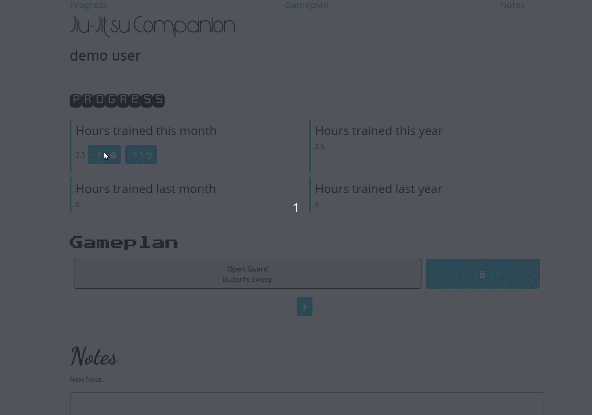

</details>

## What this is not

This isn't a tutorial and not the perfect way to do things with best practices. If that's what you're looking for I'll point you to [The Odin Project](https://www.theodinproject.com/).

## What this is

This is an insight into my thought process and how I typically go about starting a personal project, including my mistakes and struggles along the way.

I created a few MEN stack sites (that's a thing right?) but I just used server side rendered templates for views. I wanted to improve my React skills so I decided I'd put all my knowledge together to create a MERN (MongoDB, Express, React, Node) site.

Some parts of this post are retrospective while others were very much me switching between writing and coding, using the editor as a rubber duck as I thought out loud about my next steps.

There are some walls of code that I've included in dropdowns, the emphasis is less on the code here, you can take a cursory glance or dive as deep as you want but I'll just reiterate that I'm fairly new to the React world and I'm sure there are better ways to create single page apps than my solution.

## Table of Contents

* [The finshed project](#the-finshed-project)
* [What this is not](#what-this-is-not)
* [What this is](#what-this-is)
* [Initial Ideas](#initial-ideas)
* [create-react-app](#create-react-app)
* [Main Components](#main-components)
* [Layout Component](#layout-component)
* [Starting the Gameplan section](#starting-the-gameplan-section)
* [Adding Bootstrap](#adding-bootstrap)
* [express-generator](#express-generator)
* [Models Code and Controllers Setup](#models-code-and-controllers-setup)
* [Express server code and JWT Passport Authentication Strategy](#express-server-code-and-jwt-passport-authentication-strategy)
* [Controller Code](#controller-code)
* [Connecting to the database](#connecting-to-the-database)
* [Testing protected routes with Postman](#testing-protected-routes-with-postman)
* [Sign-up and log-in forms](#sign-up-and-log-in-forms)
* [Gameplan Features](#gameplan-features)
* [Saving Gameplans to the database](#saving-gameplans-to-the-database)
* [More Gameplan Features](#more-gameplan-features)
* [Progress Section](#progress-section)
* [Basic style for the Progress section](#basic-style-for-the-progress-section)
* [Notes Section](#notes-section)
* [Styling everything](#styling-everything)
* [Deployment](#deployment)
* [Conclusion](#conclusion)

## Initial Ideas

Firstly, I'll layout my ideas for the app, which may or may not all come to fruition.

* Use the MERN stack to build a Jiu-Jitsu companion app.
* Users can create a gameplan (what to do when in each position during a roll)
* Users can save their notes for each class and go back to review
* Users can track their progress (hours trained, belt level, etc)
* Users can create an account (Passport authentication, Bcrypt to Hash password)

I spent a while trying to figure out how I'm going to "connect" the frontend and backend but decided I'll cross that bridge when I come to it.

## create-react-app

Time to get up and running with some code

```bash
create-react-app jiu-jitsu-companion
cd jiu-jitsu-companion
code .
```

I'd like to get something onscreen so I can start to get a feel for how the app is going to work.

First I'll run npm start from the terminal in VScode

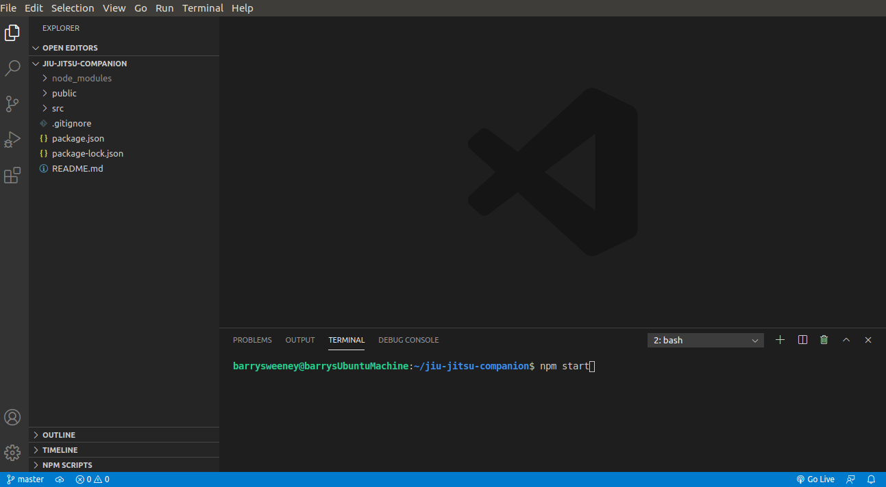

Jumping over to localhost:3000 I can see the default starter page

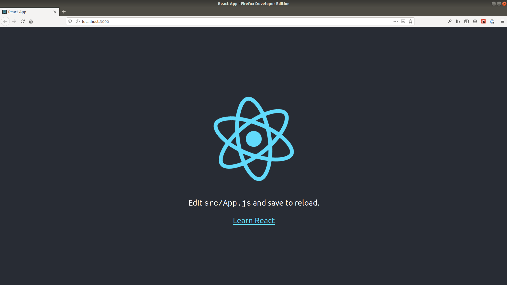

I'll leave that window open so I can see the results of my changes to the source code courtesy of the hot reloading.

Next, I'll slim down the App.js file by removing the logo import and all child elements of the div with the className of App

```jsx
import React from "react"
import logo from "./logo.svg"
import "./App.css"

function App() {
  return <div className="App"></div>
}

export default App
```

and update the App.css file to remove everything apart from the App selector

```css
.App {
  text-align: center;
}
```

I'll also remove the App.test.js and logo.svg files as I no longer need these.

My slimmed down folder structure is a bit less overwhelming now

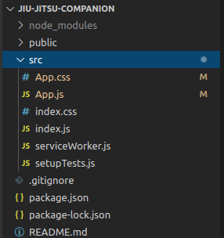

## Main Components

There's going to be three main parts of the application, The gameplan, notes and progress sections. I'll create components and headings for each of these:

<details>
<summary>> 
App.js <br/><br/>
</summary>

```jsx
import React from "react"
import "./App.css"

function Progress() {
  return (
    <header>
      <h2>Progress</h2>
    </header>
  )
}

function Notes() {
  return (
    <header>
      <h2>Notes</h2>
    </header>
  )
}

function Gameplan() {
  return (
    <header>
      <h2>Gameplan</h2>
    </header>
  )
}

function App() {
  return (
    <div className="App">
      <Progress />
      <Notes />
      <Gameplan />
    </div>
  )
}

export default App
```

</details>

With those changes I can already see some progress on screen and feel like I'm gaining a bit of momentum:

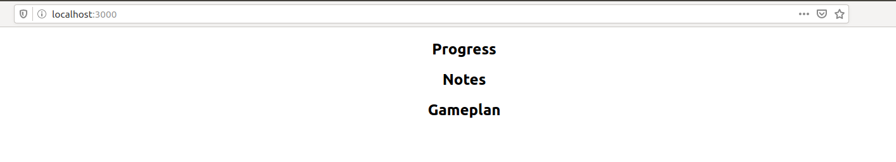

That's good but I don't like how large the App.js file is getting so I'll get down to some refactoring next

I'll simply highlight each component in turn and hit ctrl+shift+r to bring up this menu:

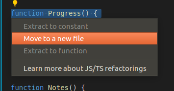

I'll resist the urge to learn more about JS/TS refactorings (with some difficulty) and then select "Move to a new file" and VS Code will do the rest, automatically adding the necessary imports:


## Layout Component

Next I'll set up a layout component inside a new components folder. I'm conceptually thinking of the different sections as pages and not including them in this components folder at this point

<details>
<summary>> layout.js <br/><br/></summary>

```jsx
import React from "react"

export default function Layout({ children }) {
  return (
    <div>
      <nav>
        <ul>
          <li>
            <a href="#">Progress</a>
          </li>
          <li>
            <a href="#">Notes</a>
          </li>
          <li>
            <a href="#">Gameplan</a>
          </li>
        </ul>
      </nav>
      <header>
        <h1>Jiu-Jitsu Companion</h1>
      </header>
      {children}
      <footer>The footer</footer>
    </div>
  )
}
```

</details>
I'll also make some changes to App.js to include the Layout wrapper

```jsx
// ...
import Layout from "./components/layout"

function App() {
  return (
    <Layout>
      <Progress />
      <Notes />
      <Gameplan />
    </Layout>
  )
}
// ...
```

The elipses represents unchanged code which I've omitted for brevity.

With that the file structure is changed a bit:

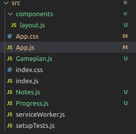

and the site is rendering the layout component correctly:

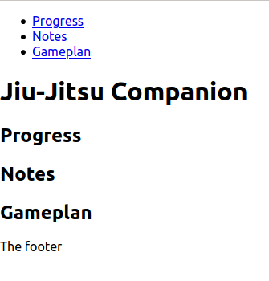

At this point, I'd like to add some styling to keep on top of that. I'll install styled-components using npm and import that into layout.js

```bash
npm install --save styled-components
```

I'll then create some styled components for the navigation bar and main container for the site:

<details>
<summary>> layout.js <br/><br/></summary>

```jsx
import React from "react"
import styled from "styled-components"

const Container = styled.div`
  height: 100vh;
  width: 700px;
  margin: 0 auto;
  display: grid;
  grid-template-rows: auto auto 1fr auto;
`

const NavList = styled.ul`
  list-style: none;
  display: grid;
  grid-template-columns: repeat(auto-fill, minmax(200px, 1fr));
`

export default function Layout({ children }) {
  return (
    <Container>
      <nav>
        <NavList>
          <li>
            <a href="#">Progress</a>
          </li>
          <li>
            <a href="#">Notes</a>
          </li>
          <li>
            <a href="#">Gameplan</a>
          </li>
        </NavList>
      </nav>
      <header>
        <h1>Jiu-Jitsu Companion</h1>
      </header>
      {children}
      <footer>The footer</footer>
    </Container>
  )
}
```

</details>

The line `grid-template-rows: auto auto 1fr auto;` creates a 4 row grid with the content (the Progress, Notes and Gameplan sections) filling the free space. To have this work, App.js should be edited to wrap those sections in a single parent element

```jsx
// ...
function App() {
  return (
    <Layout>
      <div>
        <Progress />
        <Notes />
        <Gameplan />
      </div>
    </Layout>
  )
}
// ...
```

The desired layout is now set up:

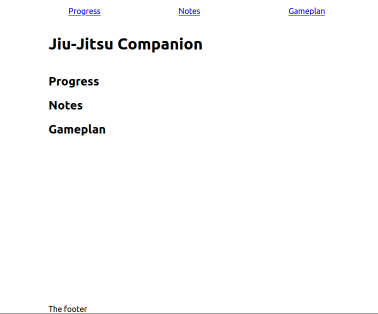

## Starting the Gameplan section

At this point I think it's best to narrow the focus to a single section of the site. I'm going to start with the gameplan section.

I'd like to ultimately achieve something like this sketch:


As you can see, each move can lead to a position from which there is an opportunity to perform different moves, which in turn lead to a different position. (I guess you're up to speed on the business rules now).

I'm immediately thinking of divs with drag and drop event listeners so I'll attempt to implement that to begin on a really small scale.

I'll install react-icons for the arrows

```bash
npm i --save react-icons
```

Here's the work on the hardcoded grid in gameplan.js

<details>
<summary>> gameplan.js<br/><br/></summary>

```jsx
import React from "react"
import styled from "styled-components"
import {
  BsArrowDownRight,
  BsArrowRight,
  BsArrowLeft,
  BsArrowUpRight,
  BsArrowUpLeft,
  BsArrowDownLeft,
  BsArrowUp,
  BsArrowDown,
} from "react-icons/bs"

const PositionWrapper = styled.div`
  ul {
    list-style: none;
  }

  background: #eee;
  padding: 10px;
  margin: 10px;
  border: 1px solid #000;
  border-radius: 5px;
  display: inline-block;
`

const GameplanGrid = styled.div`
  display: grid;
  grid-template-columns: repeat(auto-fit, minmax(200px, 1fr));
`

const Position = props => {
  return (
    <PositionWrapper>
      <h3>{props.position}</h3>
      <ul>
        {props.moves.map(move => (
          <li>
            {move.name} {move.arrow}
          </li>
        ))}
      </ul>
    </PositionWrapper>
  )
}

export function Gameplan() {
  return (
    <div>
      <header>
        <h2>Gameplan</h2>
      </header>
      <GameplanGrid>
        <Position
          position="Position 1"
          moves={[{ name: "Move 1", arrow: <BsArrowRight /> }]}
        />
        // 8 more Position components ...
      </GameplanGrid>
    </div>
  )
}
```

</details>

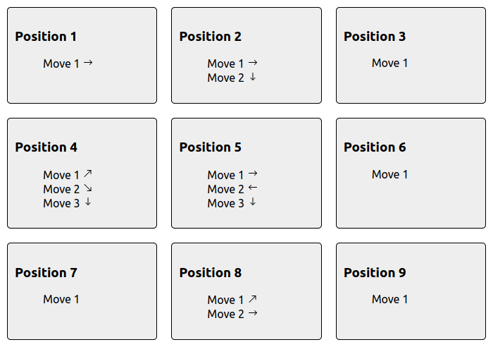

I'm happy with the overall layout apart from the arrows, but at least their intent is clear. I'm thinking I wont implement the drag and drop functionality just yet, but make it so positions and moves can be input with text boxes for now, maybe replacing this later with a drop down of moves and positions with the option to add your own. I'll make the following changes across each Position

```jsx
<Position
  position={<input placeholder="Position Name" style={{ width: `80%` }} />}
  moves={[
    {
      name: <input placeholder="Move Name" style={{ width: `70%` }} />,
      arrow: <BsArrowRight />,
    },
  ]}
/>
```

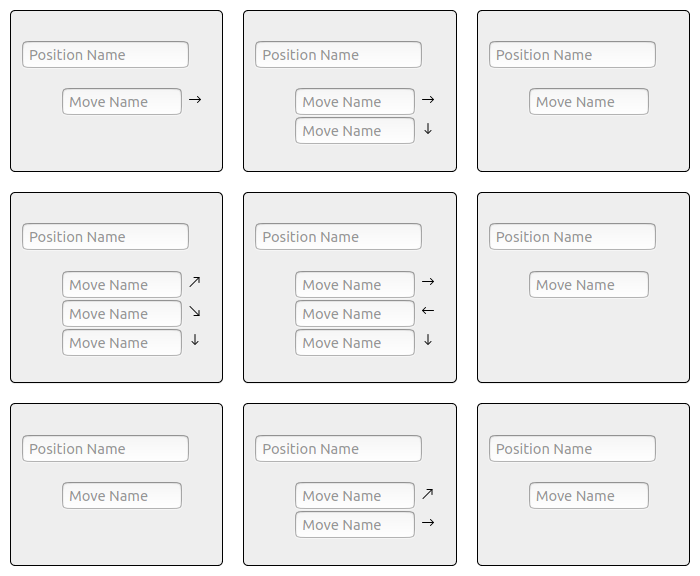

If I want to make the drag and drop functionality work, the arrows could be tricky, an easy approach which I'll try first will be to have a large grid where arrows will actually fill up a grid track.

While attempting to implement that I ran into a few problems and as I began to think about a responsive mobile layout, I decided I'm going to change the gameplan grid to more of a gameplan flow chart. I'm definitely stepping back the complexity with this decision but following the KISS principle: Keep it simple stupid.

Here are the important changes to gameplan.js, perhaps the most important of which was changing the GameplanGrid styled component to `grid-template-columns: 1fr;`

<details>
<summary>> gameplan.js</summary>

```jsx
// ...
import { BsArrowDown } from "react-icons/bs"

const PositionWrapper = styled.div`
  ul {
    list-style: none;
    padding-left: 0;
  }

  background: #eee;
  padding: 10px;
  margin: 10px;
  border: 1px solid #000;
  border-radius: 5px;
  text-align: center;
`

const GameplanGrid = styled.div`
  display: grid;
  grid-template-columns: 1fr;
`

const ArrowWrapper = styled.div`
  font-size: 70px;
  text-align: center;
  padding: 10px;
  margin: 10px;
`

const Position = props => {
  return (
    <PositionWrapper>
      {props.position}
      <ul>
        {props.moves.map(move => (
          <li>{move.name}</li>
        ))}
      </ul>
    </PositionWrapper>
  )
}

export function Gameplan() {
  return (
    <div>
      <header>
        <h2>Gameplan</h2>
      </header>
      <GameplanGrid>
        <Position
          position={<input placeholder="Position Name" />}
          moves={[
            {
              name: <input placeholder="Move Name" />,
            },
          ]}
        />
        <ArrowWrapper>
          <BsArrowDown />
        </ArrowWrapper>
        // more Positions and downward arrows ...
      </GameplanGrid>
    </div>
  )
}
```

</details>

### Adding Bootstrap

To fix up the layout I'll use Bootstrap:

```bash
npm install react-bootstrap bootstrap
```

and add the CSS by importing it at the top of index.js

```jsx
import "bootstrap/dist/css/bootstrap.min.css"
```

and include the CDN in index.html

```html
<link
  rel="stylesheet"
  href="https://maxcdn.bootstrapcdn.com/bootstrap/4.5.0/css/bootstrap.min.css"
  integrity="sha384-9aIt2nRpC12Uk9gS9baDl411NQApFmC26EwAOH8WgZl5MYYxFfc+NcPb1dKGj7Sk"
  crossorigin="anonymous"
/>
```

With Bootstrap setup I can now use it for a responsive layout by heading over to layout.js:

<details>
<summary>> layout.js<br/><br/></summary>

```jsx
// ...
import Container from "react-bootstrap/Container"

const GridContainer = styled.div`
  height: 100vh;
  width: 100%;
  margin: 0 auto;
  display: grid;
  grid-template-rows: auto auto 1fr auto;
`

// ...

export default function Layout({ children }) {
  return (
    <Container>
      <GridContainer>// ...</GridContainer>
    </Container>
  )
}
```

</details>
Due to the naming collision I renamed my Container component to GridContainer and wrapped it in the Bootstrap Container.

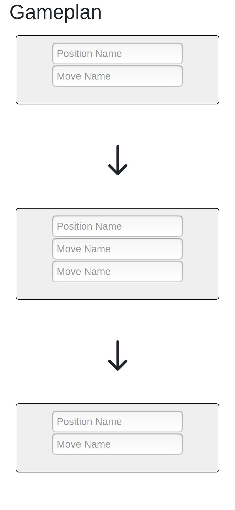

Each Gameplan will be very niche now that each position is only connected to a single other position. To accomodate, I'll make it so each position will only have one move. Each Position in the GameplanGrid now looks like this:

```jsx
<Position
  position={<input placeholder="Position Name" />}
  moves={[
    {
      name: <input placeholder="Move Name" />,
    },
  ]}
/>
```

## express-generator

With that done, I'll start working on some of the backend functionality.

I'll put all of the code thus far into a folder called frontend, create a new folder called backend, open up a new terminal, and issue the following commands:

```bash
cd backend
npx express-generator
npm install
```

The folder structure now looks like this: 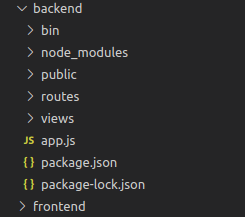

I'll head into bin/www and change the port number from 3000 to 9000 as the frontend will be on 3000

```jsx
var port = normalizePort(process.env.PORT || "9000")
```

I'll run npm start from within the backend folder to start the backend server:

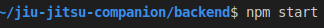

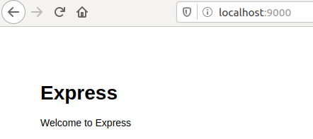

## Models Code and Controllers Setup

I'll need Gameplan and User models and controllers so I'll set those files up with the following commands from within the backend folder:

```
mkdir models controllers
touch models/user.js models/gameplan.js controllers/gameplanController.js controllers/userController.js
```

<details>
<summary>> user.js<br/><br/></summary>

```jsx
const mongoose = require("mongoose")
const Schema = mongoose.Schema

const UserSchema = new Schema({
  username: { type: String, required: true },
  password: { type: String, required: true },
})

module.exports = mongoose.model("User", UserSchema)
```

</details>

I'm planning to have the positions stored in state and a save button that creates a post request to store the positions in the database (as a String which I can later parse to retrieve the positions again).

<details>
<summary>> gameplan.js<br/><br/></summary>

```jsx
const mongoose = require("mongoose")
const Schema = mongoose.Schema

const GameplanSchema = new Schema({
  title: { type: String, required: true },
  positions: { type: String, required: true },
  user: { type: Schema.Types.ObjectId, ref: "User", required: true },
})

module.exports = mongoose.model("Gameplan", GameplanSchema)
```

</details>

## Express server code and JWT Passport Authentication Strategy

I'll head over to app.js, setup a mongoose connection and authentcation using the Passport JWT strategy. I'll also use some packages for security and compression, including cors to allow the backend and frontend to communicate later:

<details>
<summary>> app.js<br/><br/></summary>

```jsx
const createError = require("http-errors")
const express = require("express")
const path = require("path")
const cookieParser = require("cookie-parser")
const logger = require("morgan")
require("dotenv").config()

const JwtStrategy = require("passport-jwt").Strategy,
  ExtractJwt = require("passport-jwt").ExtractJwt
const passport = require("passport")
const User = require("./models/user")

const cors = require("cors")
const session = require("express-session")
const helmet = require("helmet")
const compression = require("compression")

const indexRouter = require("./routes/index")
const gameplansRouter = require("./routes/gameplan")
const usersRouter = require("./routes/user")

const app = express()

// Set up mongoose connection
const mongoose = require("mongoose")
const mongoDB = process.env.MONGODB_URI
mongoose.connect(mongoDB, { useNewUrlParser: true })
const db = mongoose.connection
db.on("error", console.error.bind(console, "MongoDB connection error:"))

// view engine setup
app.set("views", path.join(__dirname, "views"))
app.set("view engine", "jade")

app.use(helmet())
app.use(cors())
app.use(logger("dev"))
app.use(express.json())
app.use(express.urlencoded({ extended: false }))
app.use(cookieParser())
app.use(compression())
app.use(express.static(path.join(__dirname, "public")))
app.use(
  session({
    secret: process.env.SESSION_SECRET,
    resave: false,
    saveUninitialized: true,
  })
)

const opts = {}
opts.jwtFromRequest = ExtractJwt.fromAuthHeaderAsBearerToken()
opts.secretOrKey = process.env.SECRET_KEY

passport.use(
  new JwtStrategy(opts, function (jwt_payload, done) {
    console.log(jwt_payload)

    User.findOne({ username: jwt_payload.username }, function (err, user) {
      if (err) {
        return done(err, false)
      }
      if (user) {
        return done(null, user)
      } else {
        return done(null, false)
      }
    })
  })
)

app.use(passport.initialize())
app.use(passport.session())

app.use("/", indexRouter)
app.use("/gameplans", gameplansRouter)
app.use("/users", userController)

// catch 404 and forward to error handler
app.use(function (req, res, next) {
  next(createError(404))
})

// error handler
app.use(function (err, req, res, next) {
  // set locals, only providing error in development
  res.locals.message = err.message
  res.locals.error = req.app.get("env") === "development" ? err : {}

  // render the error page
  res.status(err.status || 500)
  res.render("error")
})

module.exports = app
```

</details>
and install the packages used:

```bash
npm i --save dotenv passport passport-jwt cors express-session helmet compression mongoose
```

I'll now make changes to the routes folder to finalize the setup of the JWT strategy:

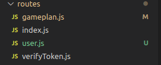

<details>
<summary>> user.js</summary>

```jsx
const express = require("express")
const router = express.Router()
const user_controller = require("../controllers/userController")

// POST request for creating user
router.post("/create", user_controller.user_create_post)

module.exports = router
```

</details>

<details>
<summary>> gameplan.js</summary>

```jsx
const express = require("express")
const router = express.Router()
const verify = require("./verifyToken")
const gameplan_controller = require("../controllers/gameplanController")

// GET request for all gameplans
router.get("/all", verify, gameplan_controller.gameplan_all)

// POST request for creating a gameplan
router.post("/new", verify, gameplan_controller.gameplan_create_post)

module.exports = router
```

</details>
<details>
<summary>> index.js</summary>

```jsx
const express = require("express")
const router = express.Router()
const jwt = require("jsonwebtoken")
const User = require("../models/user")
const bcrypt = require("bcryptjs")

router.get("/", function (req, res, next) {
  res.redirect("/gameplans")
})

// POST request for logging in
router.post("/log-in", async (req, res) => {
  const user = await User.findOne({ username: req.body.username })
  if (!user)
    return res.status(400).send("Username and/or password is incorrect")

  const validPassword = await bcrypt.compare(req.body.password, user.password)
  if (!validPassword) return res.sendStatus(400)

  const token = jwt.sign({ _id: user._id }, process.env.SECRET_KEY)
  res.header("auth-token", token).send(token)
  res.redirect(req.get("referer"))
})

// GET request for logging out
router.get("/log-out", (req, res) => {
  req.logout()
  res.redirect(req.get("referer"))
})

module.exports = router
```

</details>
<details>
<summary>> verifyToken.js<br/><br/></summary>

```jsx
const jwt = require("jsonwebtoken")

// middleware function to add to protected routes
module.exports = function (req, res, next) {
  const token = req.header("auth-token")
  if (!token) return res.status(401).send("Access Denied")

  try {
    const verified = jwt.verify(token, process.env.SECRET_KEY)
    req.user = verified
    next()
  } catch (err) {
    res.status(400).send("Invalid token")
  }
}
```

</details>
and install the new packages used with the following command:

```bash
npm i --save bcryptjs jsonwebtoken
```

## Controller Code

I'll now setup the controllers that were created earlier:

<details>
<summary>> userController.js<br/><br/></summary>

```jsx
const User = require("../models/user")
const validator = require("express-validator")
const bcrypt = require("bcryptjs")

// handle user create on POST
exports.user_create_post = [
  validator.body("username").trim(),
  // sanitize all fields
  validator.sanitizeBody("*").escape(),
  // process request after validation and sanitization
  (req, res, next) => {
    // extract validation errors from request
    const errors = validator.validationResult(req)
    if (!errors.isEmpty()) {
      // there are errors
      res.sendStatus(500)
    } else {
      // create and save a user object with escaped data and hashed password
      bcrypt.hash(req.body.password, 10, (err, hashedPassword) => {
        if (err) {
          return next(err)
        }
        const user = new User({
          username: req.body.username,
          password: hashedPassword,
        }).save(err => {
          if (err) {
            return next(err)
          }
          res.sendStatus(201)
        })
      })
    }
  },
]
```

</details>
and run:

```bash
npm i --save express-validator
```

<details>
<summary>> gameplanController.js</summary>

```jsx
const Gameplan = require("../models/gameplan")

// list of all gameplans
exports.gameplan_all = function (req, res) {
  Gameplan.find({})
    .populate("user")
    .exec(function (err, gameplan_list) {
      if (err) {
        return next(err)
      }
      res.json(gameplan_list)
    })
}

// handle gameplan create on POST
exports.gameplan_create_post = function (req, res, next) {
  const gameplan = new Gameplan({
    title: req.body.title,
    positions: req.body.positions,
    user: req.user._id,
  }).save(err => {
    if (err) {
      return next(err)
    }
    res.sendStatus(200)
  })
}
```

</details>

## Connecting to the database

I'll now start setting up the database.

I'll log in to MongoDB Atlas and create a new project: 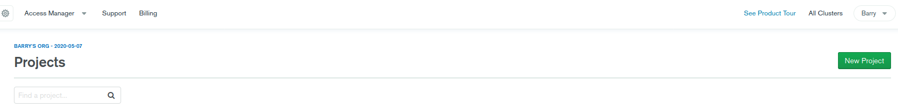 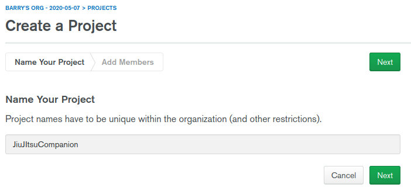 I'll then start creating a new cluster:
 After following the steps to create a free tier cluster with the default settings I'll start the connection process:
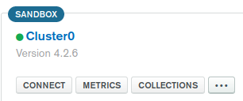 I'll whitelist all IP addresses for now. This should be changed when I know the IP address of where the request will come from after deployment:
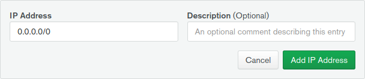 I'll then create a MongoDB User and select "Connect your application" and select the Node.js driver and copy the provided connection string:

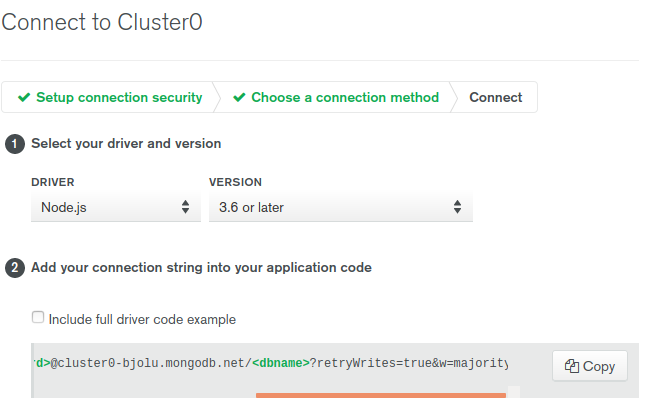

I'll then go into the cluster's collections and create a new database: 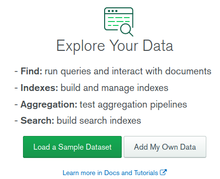 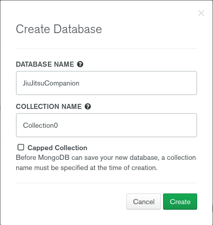

With the database setup I'll create a .env file with a `MONGODB_URI`, `SECRET_KEY`, and `SESSION_SECRET`

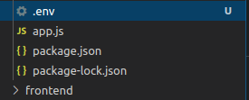

## Testing protected routes with Postman

I'll now try to create a user and retrieve a token by making a request with Postman:

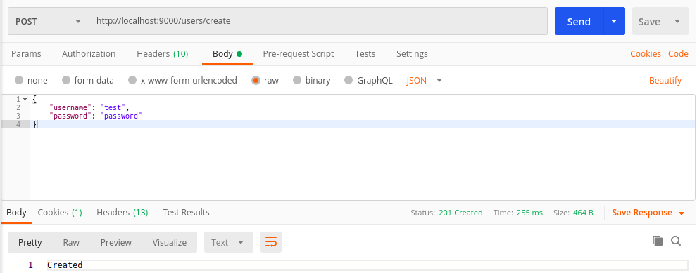

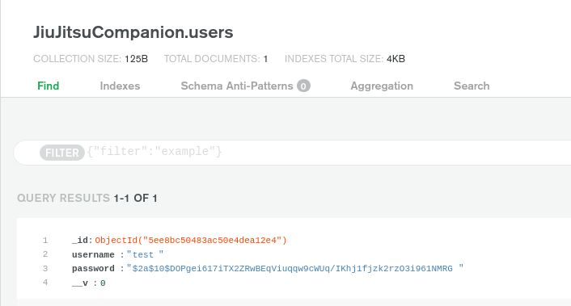

I'll not send a post request to the login route with the same username and password:

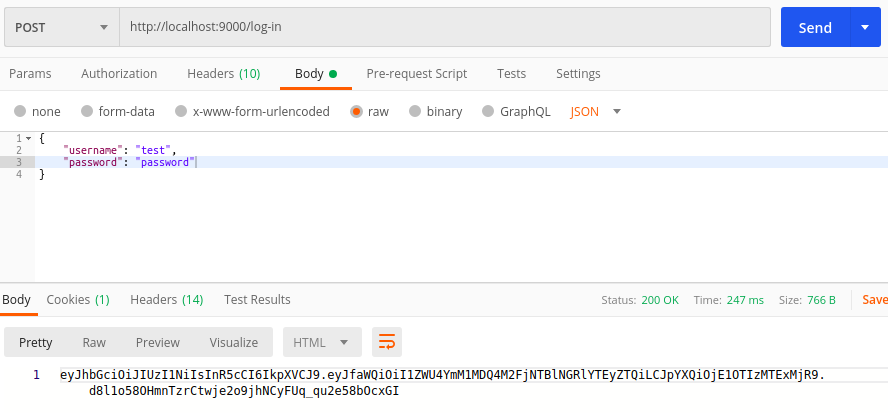

I'll now copy that token from the respoinse body and use it as an authorization header to access a protected route.

As you can see, without the header, access is denied:

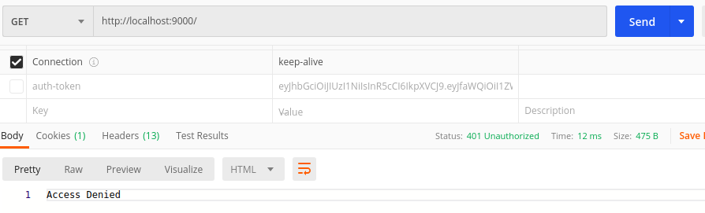

Adding the header should grant access:

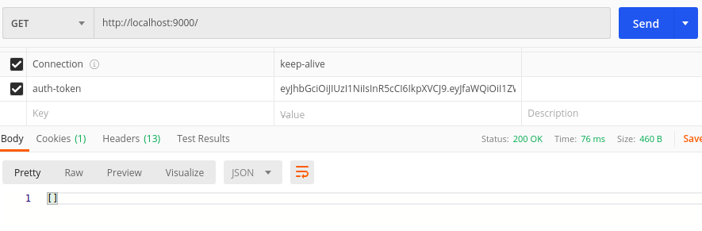

## Sign-up and log-in forms

I can now switch back to the front-end and setup forms to sign-up and log-in:

<details>
<summary>> App.js<br/><br/></summary>

```jsx
// ...
import Login from "./login"

class App extends Component {
  constructor(props) {
    super(props)
    this.state = {
      authenticated: false,
    }
  }

  setAuthenticated() {
    this.setState({ authenticated: true })
  }

  render() {
    return (
      <Layout>
        {this.state.authenticated ? (
          <div>
            <Progress />
            <Notes />
            <Gameplan />
          </div>
        ) : (
          <Login setAuthenticated={this.setAuthenticated.bind(this)} />
        )}
      </Layout>
    )
  }
}
```

</details>
I've changed the functional component to a class based component and I'm displaying a Login form if the user isn't already authenticated.
<details>
<summary>> login.js<br/><br/></summary>

```jsx
import React, { Component } from "react"
import styled from "styled-components"

const Button = styled.button`
  background: red;
  padding: 10px;
  margin: 10px 0;
  text-transform: uppercase;
  color: white;
  border-radius: 5px;
  font-weight: 600;
  border: 0;
`

class Login extends Component {
  constructor(props) {
    super(props)
    this.state = {
      signingUp: false,
    }
  }

  async submitHandler(e) {
    e.preventDefault()
    const username = e.target.username.value
    const password = e.target.password.value
    const body = {}
    body.username = username
    body.password = password
    const response = await fetch("http://localhost:9000/log-in", {
      method: "POST",
      headers: {
        "Content-Type": "application/json",
      },
      body: JSON.stringify(body),
    })
    if (response.status === 200) {
      const token = await response.text()
      localStorage.setItem("auth-token", token)
      // re-render the App component, setting it's state to authenticated:true
      this.props.setAuthenticated()
    }
  }

  startSignUp() {
    this.setState({ signingUp: true })
    this.render()
  }

  async signupHandler(e) {
    e.preventDefault()
    const username = e.target.username.value
    const password = e.target.password.value
    const body = {}
    body.username = username
    body.password = password
    const response = await fetch("http://localhost:9000/users/create", {
      method: "POST",
      headers: {
        "Content-Type": "application/json",
      },
      body: JSON.stringify(body),
    })
    if (response.status === 201) {
      this.setState({ signingUp: false })
      this.render()
    }
  }

  render() {
    return (
      <div>
        {this.state.signingUp ? (
          <div>
            <form action="#" onSubmit={this.signupHandler.bind(this)}>
              <label htmlFor="username">Username</label>
              <br />
              <input type="text" name="username" />
              <br />
              <label htmlFor="password">Password</label>
              <br />
              <input type="password" name="password" />
              <br />
              <Button>Sign Up</Button>
            </form>
          </div>
        ) : (
          <div>
            <form action="#" onSubmit={this.submitHandler.bind(this)}>
              <label htmlFor="username">Username</label>
              <br />
              <input type="text" name="username" />
              <br />
              <label htmlFor="password">Password</label>
              <br />
              <input type="password" name="password" />
              <br />
              <Button>Log in</Button>
            </form>
            <p>Don't have an account?</p>
            <Button onClick={this.startSignUp.bind(this)}>Sign up</Button>
          </div>
        )}
      </div>
    )
  }
}

export default Login
```

</details>

Here I'm presenting the login form. If the user needs to create an account they can click the sign up button to open a sign up form. When signed up and logged in the authentication token is stored in local storage and the state of the App component is updated to indicate that the user is authenticated, which will cause the App to re-render with the authenticated conditional being met and the sites content being displayed:

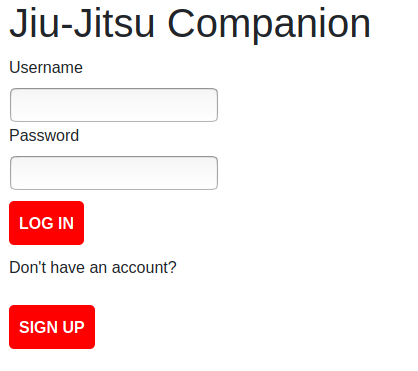

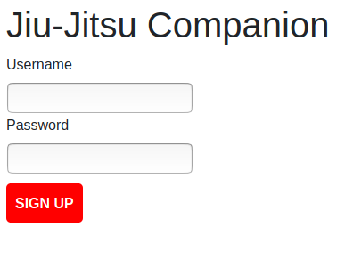

## Gameplan Features

Now I should get back to work on the gameplan functionality; allowing users to save their gameplans, add positions, etc.

* Adding a new position should save the current. When saved, I can add its position and move to the Gameplan's state.
* The positions and moves arrays in state can then be saved to the database. When the app is started they can be brought back in.
* The components should conditionally render the database info or defaults.
* The positionCount will also need saved as an array of this length is mapped over to render the positions and arrows.

In tackling the feature that adding a new position will save the current position to the parent components state, I've come up with the follwing solution.

<details>
<summary>> Gameplan.js<br/><br/></summary>

```jsx
//...
import { Position } from "./components/Position"

//...

class Gameplan extends Component {
  constructor(props) {
    super(props)
    this.state = {
      positionCount: 1,
      positions: [],
      moves: [],
    }
  }

  setPositionandMove(position, move) {
    this.setState({
      positions: this.state.positions.concat([position]),
      moves: this.state.moves.concat([move]),
      positionCount: this.state.positionCount,
    })
  }

  addPosition() {
    this.setState({
      positionCount: (this.state.positionCount += 1),
    })
  }

  render() {
    return (
      <div>
        <header>
          <h2>Gameplan</h2>
        </header>

        <GameplanGrid>
          {[...Array(this.state.positionCount)].map((i, index) => {
            if (index === this.state.positionCount - 1) {
              return (
                <Position
                  position={this.state.positions[index]}
                  move={this.state.moves[index]}
                  addPosition={this.addPosition.bind(this)}
                  saved={false}
                  setPositionandMove={this.setPositionandMove.bind(this)}
                />
              )
            } else {
              return (
                <div>
                  {" "}
                  <Position
                    position={this.state.positions[index]}
                    move={this.state.moves[index]}
                    saved={true}
                    setPositionandMove={this.setPositionandMove.bind(this)}
                  />
                  <ArrowWrapper>
                    <BsArrowDown />
                  </ArrowWrapper>
                </div>
              )
            }
          })}
        </GameplanGrid>
        <Button onClick={this.saveGameplan}>Save Gameplan</Button>
      </div>
    )
  }
}

export default Gameplan
```

</details>

I've moved the Position component to components folder:

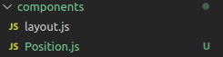

Inputs for a position and move name are displayed along with a new position button.

When the new position button is clicked, the values of these inputs are stored in the parent component's state and the addPosition method passed from the parent is called. This increments a position counter. The counter tells the Gameplan component how many positions to render to the screen.

All positions apart from the new one are passed a prop to indicate they have been saved. This will change what is rendered from the Position prop. Saved positions will have text for the position and move names as opposed to inputs and will not render an add position button.

<details>
<summary>> Position.js<br/><br/></summary>

```jsx
import React, { Component } from "react"
import styled from "styled-components"
import { Button } from "../Gameplan"

export const PositionWrapper = styled.div`
  background: #eee;
  padding: 10px;
  margin: 10px;
  border: 1px solid #000;
  border-radius: 5px;
  text-align: center;
  display: grid;
  grid-template-rows: 1fr 1fr;
  justify-content: center;
`

export class Position extends Component {
  constructor(props) {
    super(props)
    this.state = {
      position: this.props.position,
      move: this.props.move,
      saved: this.props.saved,
    }
  }

  updatePosition(e) {
    this.setState({
      position: e.target.value,
      move: this.state.move,
      saved: this.state.saved,
    })
  }

  updateMove(e) {
    this.setState({
      position: this.state.position,
      move: e.target.value,
      saved: this.state.saved,
    })
  }

  addPosition() {
    this.props.setPositionandMove(this.state.position, this.state.move)
    this.props.addPosition()
  }

  render() {
    return (
      <div>
        {this.state.saved ? (
          <PositionWrapper>
            <span>{this.props.position}</span>
            <span>{this.props.move}</span>
          </PositionWrapper>
        ) : (
          <div>
            <PositionWrapper>
              <input
                placeholder="Position Name"
                onChange={this.updatePosition.bind(this)}
                value={this.state.position}
              />
              <input
                placeholder="Move Name"
                onChange={this.updateMove.bind(this)}
                value={this.state.move}
              />
            </PositionWrapper>

            <Button onClick={this.addPosition.bind(this)}>Add Position</Button>
          </div>
        )}
      </div>
    )
  }
}
```

</details>

Here's how things look now:

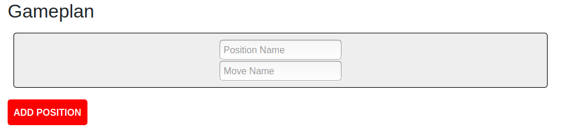

I'll now input a position and move name, then I'll click the button to add a position to see the result:


To peek behind the scenes, we can use the React Developer Tools add-on to view the Gameplan's state at this point

![React Developer Tools panel showing the state of the Gameplan component which is
"{
  "positionCount": 2,
  "positions": \[
    "Closed Guard"
  \],
  "moves": \[
    "Butterfly Sweep"
  \]
}"](gameplan-state.png)

I'll change the automatic saving when adding a new position and instead make it so the user has to explicitly click to save the position before adding a new position. This should fix the current bug where the last component won't be saved or will be undefined when stored in the database.

The Gameplan now renders positions and passes specific props to them based on the Gameplan state, namely the move array length (choosing the move array over the position array was an arbitrary choice since their lengths are the same throughout the application) and the boolean addingNewPosition.

<details>
<summary>> Gameplan.js<br/><br/></summary>

```jsx
// ...

class Gameplan extends Component {
  constructor(props) {
    super(props)
    this.state = {
      positions: [],
      moves: [],
      addingNewPosition: true,
    }
  }

  setPositionandMove(position, move) {
    this.setState({
      positions: this.state.positions.concat([position]),
      moves: this.state.moves.concat([move]),
      addingNewPosition: false,
    })
  }

  addPosition() {
    this.setState({
      addingNewPosition: true,
    })
  }

  render() {
    return (
      // ...

      <GameplanGrid>
        {[...Array(this.state.moves.length)].map((i, index) => {
          return (
            <div>
              {index !== 0 ? (
                <ArrowWrapper>
                  <BsArrowDown />
                </ArrowWrapper>
              ) : null}
              <Position
                position={this.state.positions[index]}
                move={this.state.moves[index]}
                saved={true}
                addPosition={this.addPosition.bind(this)}
                displayAddPositionButton={
                  index === this.state.moves.length - 1 &&
                  !this.state.addingNewPosition
                }
                setPositionandMove={this.setPositionandMove.bind(this)}
              />
            </div>
          )
        })}
        {this.state.addingNewPosition ? (
          <div>
            {this.state.moves.length !== 0 ? (
              <ArrowWrapper>
                <BsArrowDown />
              </ArrowWrapper>
            ) : null}
            <Position
              addPosition={this.addPosition.bind(this)}
              saved={false}
              setPositionandMove={this.setPositionandMove.bind(this)}
            />
          </div>
        ) : null}
      </GameplanGrid>
      // ...
    )
  }
}
// ...
```

</details>

The position component will render either input boxes, fixed text, a save button and an add position button based on props passed from Gameplan.

<details>
<summary>> Position.js<br/><br/></summary>

```jsx
// ...

export class Position extends Component {
  // ...

  savePosition() {
    this.props.setPositionandMove(this.state.position, this.state.move)
  }

  addPosition() {
    this.props.addPosition()
  }

  render() {
    return (
      <div>
        {this.state.saved ? (
          <div>
            <PositionWrapper>
              <span>{this.props.position}</span>
              <span>{this.props.move}</span>
            </PositionWrapper>
            {this.props.displayAddPositionButton ? (
              <Button onClick={this.addPosition.bind(this)}>
                Add position
              </Button>
            ) : null}
          </div>
        ) : (
          <div>
            <PositionWrapper>
              <input
                placeholder="Position Name"
                onChange={this.updatePosition.bind(this)}
                value={this.state.position}
              />
              <input
                placeholder="Move Name"
                onChange={this.updateMove.bind(this)}
                value={this.state.move}
              />
            </PositionWrapper>
            <Button onClick={this.savePosition.bind(this)}>
              Save Position
            </Button>
          </div>
        )}
      </div>
    )
  }
}
```

</details>
The process of adding new positons to the gameplan now looks like this:

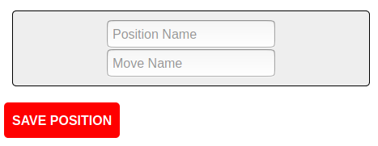

I'll now add and save a position:

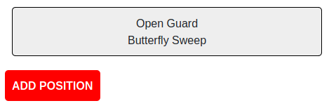

After clicking the add position button:


I'll add and save another position which will actually complete the gameplan:


Of course nothing happens when I click the save gameplan button so I'll get to work on that.

I only want the save gameplan button to show when the gameplan has been complete (the last position has been saved and no new positions are being added). I'm hoping this is as easy as a simple conditonal render based on the addingNewPosition value that is stored in the gameplans state. Here goes:

```jsx
{
  this.state.addingNewPosition ? null : (
    <Button onClick={this.saveGameplan}>Save Gameplan</Button>
  )
}
```

It was!

### Saving Gameplans to the database

OK, now onto storing the moves and positions in the database.

I think I'll send a post request to the route on the backend with stringified arrays. I feel like the difficulty will be assigning the user to the positions and moves to store in the db. I'm going to see if Passport includes the user in the request parameters based on the authentication token, that would make things a little easier.

Firstly, I'll change the Gameplan controller and models to reflect the intent of passing stringified arrays:

gameplanController.js

```jsx
// ...
// handle gameplan create on POST
exports.gameplan_create_post = function (req, res, next) {
  const gameplan = new Gameplan({
    positions: req.body.positions,
    moves: req.body.moves,
    user: req.user._id,
  }).save(err => {
    if (err) {
      return next(err)
    }
    res.sendStatus(200)
  })
}
```

models/gameplan.js

```jsx
// ...
const GameplanSchema = new Schema({
  positions: { type: String, required: true },
  moves: { type: String, required: true },
  user: { type: Schema.Types.ObjectId, ref: "User", required: true },
})
// ...
```

Now for the request from the frontend:

<details>
<summary>> gameplan.js<br/><br/></summary>

```jsx
// ...
  async savePositonsAndMovesArraysToDatabase(e) {
    e.persist();
    const token = localStorage.getItem("auth-token");
    const body = {};
    body.positions = JSON.stringify(this.state.positions);
    body.moves = JSON.stringify(this.state.moves);
    const response = await fetch("http://localhost:9000/gameplans/new", {
      method: "POST",
      headers: {
        "Content-Type": "application/json",
        "auth-token": token,
      },
      body: JSON.stringify(body),
    });
    if (response.status === 200) {
      e.target.style.display = "none";
    }
  }
  // ...
  <Button onClick={this.savePositonsAndMovesArraysToDatabase.bind(this)}>
      Save Gameplan
  </Button>
  // ...
```

</details>
After sending the request with a gameplan from a logged in user the MongoDB document looks something like this:

```
_id:ObjectId("xxxxxxxxxxx")
positions:"["Closed Guard\","Full Mount"]"
moves:""Hip bump sweep","Armbar"]"
user:ObjectId("xxxxxxxxxxxxx")
__v:0
```

Passport pulled through for me and the user was passed in the request body.

Now to load in the data from the database with a get request to populate the components initial state.

Here's the controller for the route:

<details>
<summary>> gameplanController.js<br/><br/></summary>

```jsx
//...
const validator = require("express-validator")
// ...

// handle gameplan create on POST
exports.gameplan_create_post = [
  validator.body("positions").trim(),
  validator.body("moves").trim(),
  // sanitize all fields
  validator.sanitizeBody("*").escape(),
  // process request after validation and sanitization
  function (req, res, next) {
    const gameplan = new Gameplan({
      positions: positions,
      moves: moves,
      user: req.user._id,
    }).save(err => {
      if (err) {
        return next(err)
      }
      res.sendStatus(200)
    })
  },
]
```

</details>

For now I'll just log the response to see what we're working with

frontend/src/Gameplan.js

```jsx
//...
async componentDidMount() {
    const token = localStorage.getItem("auth-token");
    const response = await fetch("http://localhost:9000/gameplans/", {
      method: "GET",
      headers: {
        "Content-Type": "application/json",
        "auth-token": token,
      },
    });
    const data = await response.json();
    if (response.status === 200 || response.status === 304) {
      const data = await response.json();
      if (data.length > 0) {
        console.log(data)
      }
  }
  // ...
```

This gives:

```jsx
;[
  {
    positions: "[&quot;Closed Guard&quot;,&quot;Full Mount&quot;]",
    moves: "[&quot;Hip bump sweep&quot;,&quot;Armbar&quot;]",
  },
]
```

Ok, there are two problems here.

The first is that the response is an array to account for the possibility of multiple different gameplans in the future.

To keep things simple for now I'll just keep it to one gameplan per user by getting the gameplan at index 0 (although I'm already envisioning giving a name to each gameplan and drop down list to select which one to view).

The second problem is that the positions are a string, not an array, and there are quote character entities.

I'll need to filter the response to get the positions and moves. I'll do this with the help of html-escaper so I'll also need to install that:

```bash
npm i --save html-escaper
```

<details>
<summary>> Gameplan.js<br/><br/></summary>

```jsx
//...
import { unescape } from "html-escaper";
// ...
async componentDidMount() {
    // ...
    if (response.status === 200 || response.status === 304) {
      const data = await response.json();
      if (data.length > 0) {

        const positions = unescape(data[0].positions)
          .split('","')
          .map((item) => item.replaceAll(/"|\[|\]/g, ""))
          .map((item) => item.replace("&#x2F;", "/"));

        const moves = unescape(data[0].moves)
          .split('","')
          .map((item) => item.replaceAll(/"|\[|\]/g, ""))
          .map((item) => item.replace("&#x2F;", "/"));

        this.setState({
          positions: positions,
          moves: moves,
          addingNewPosition: false,
        });
      }
    }
  // ...
```

</details>
This solution is little brittle as some characters may slip through the cracks but the worst case will likely be some funky text inside a Position component's text.

## More Gameplan Features

I'm now deciding whether to go all in with the gameplan builder, allowing multiple gameplans and making them editable or whether to start working on the notes and progress sections.

For now I'll stick to working on the Gameplan section with each user having a single gameplan. For a start, instead of getting the gameplan at index 0, I should be getting the gameplan at the last index since this will be the one that has been most recently created.

In Gameplan.js I'll change the following lines:

```jsx
// ...
const positions = unescape(data[0].positions)
// ...
const moves = unescape(data[0].moves)
// ...
```

to...

```jsx
// ...
const positions = unescape(data[data.length - 1].positions)
// ...
const moves = unescape(data[data.length - 1].moves)
// ...
```

I'd now like to have the logged in user's username show above their gameplan so I'll return it in the response.

I'll pass a the username as a parameter from the login component to the app compopnent via the setAuthenticated method which is already being passed

App.js

```jsx
// ...
setAuthenticated(username) {
    this.setState({ authenticated: true, username: username });
  }
// ...
```

And now to pass the username in login.js

```jsx
async submitHandler(e) {
    e.preventDefault();
    const username = e.target.username.value;
    // ...
      this.props.setAuthenticated(username);
    }
  }
```

I'll sign up and log in with a new user:

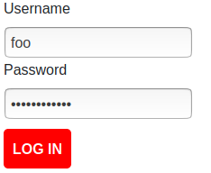

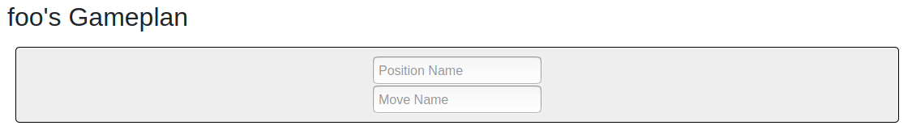

Now I'll move on to giving users the option to delete a position that has been saved.

Because I'll be creating another button I think now is a good time to move the button styled component out of the Gameplan.js file and into it's own file in the components folder.

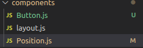

The relevant changes made to Gameplan.js to implement the delete functionality are shown below.

The `removePosition(index)` method is the crux. Besides that, a new state variable called "saveable" is initialized to false by default and changed to true or false depending on the state of the application. This variable is then used to conditionally render the save button which sends the post request to the database as mentioned before.

<details>
<summary>> Gameplan.js<br/><br/></summary>

```jsx
// ...
import { Button } from "./components/Button";

// ...

class Gameplan extends Component {
  constructor(props) {
    // ...
    this.state = {
     // ...
      saveable: false,
    };
  }

  // ...

  setPositionandMove(position, move) {
    this.setState({
      // ...
      saveable: true,
    });
  }

  async savePositonsAndMovesArraysToDatabase(e) {
  // ...
    if (response.status === 200) {
      this.setState({
        saveable: false,
      });
    }
  }

  addPosition() {
    this.setState({
      // ...
      saveable: false,
    });
  }

  removePosition(index) {
    if (this.state.positions.length === 1) {
      this.setState({
        positions: [
          ...this.state.positions.slice(0, index),
          ...this.state.positions.slice(index + 1),
        ],
        moves: [
          ...this.state.moves.slice(0, index),
          ...this.state.moves.slice(index + 1),
        ],
        addingNewPosition: true,
        saveable: true,
      });
    } else {
      this.setState({
        positions: [
          ...this.state.positions.slice(0, index),
          ...this.state.positions.slice(index + 1),
        ],
        moves: [
          ...this.state.moves.slice(0, index),
          ...this.state.moves.slice(index + 1),
        ],
        saveable: true,
      });
    }
  }

  render() {
    return (
      <div>
        // ...

        <GameplanGrid>
          {[...Array(this.state.moves.length)].map((i, index) => {
            return (
              <div>
               // ...
                <Position
                 // ...
                  removePosition={() => this.removePosition(index)}
                />
              </div>
            );
          })}
          {this.state.addingNewPosition ? (
            // ...
          ) : this.state.saveable ? (
            <Button
              onClick={this.savePositonsAndMovesArraysToDatabase.bind(this)}
            >
              Save Gameplan
            </Button>
          ) : null}
        </GameplanGrid>
      </div>
    );
  }
}

// ...
```

</details>

The delete button itself is actually added in the Position component to positions that have had the saved prop passed with a value of true from the parent Gameplan component.

<details>
<summary>> Position.js<br/><br/></summary>

```jsx
// ...
import { Button } from "./Button";

// ...

export class Position extends Component {
// ...

// ...

  render() {
    return (
      <div>
        {this.state.saved ? (
          <div>
            // ...
            <Button onClick={this.props.removePosition}>Delete position</Button>
          </div>
        ) : (
          // ...
        )}
      </div>
    );
  }
}
```

</details>
Here's how things are panning out:

A gameplan the user has previosuly created is shown when they log in:


I'll now delete the first position:

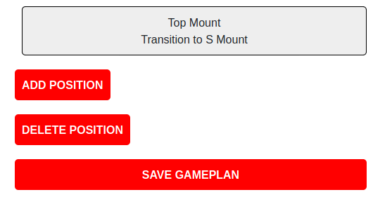

I'll delete the remaining position just to show how the option to add a new position is created and the buttons adjust accordingly:

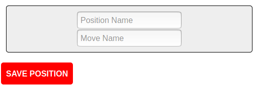

I'd like to do a few more things with the gameplan, I'll leave them to later but just take note of them now:

* Constrain the user input to letters and a select few special characters like `&` or `/`
* Add styling like a trash can icon for deleting
* Don't allow empty positions

## Progress Section

For now I'll move on the progress tracking section. I'm not entirely sure what I actually want this section to be so I'll take some time to brainstorm:

* Increment hours trained
* See hours trained by week/month/year/total with comparison
* Maybe a graph
* Possibly a seperate total for competitions, seminars etc

I'm also thinking total hours is going to be difficult as people may have been training for years and have no clue how much hours they've put in. Instead I might just have monthly hours trained where the counter resets each month, encouraging a mindset of trying to beat the previous months hours trained.

I'll begin work on a simple counter to get the ball rolling:

For now I'll just assume that seminars and competitions count towards total hours trained.

<details>
<summary>> src/Progress.js<br/><br/></summary>

```jsx
import React, { Component } from "react"
import { Button } from "./components/Button"
import styled from "styled-components"

const ProgressWrapper = styled.div`
  display: grid;
`

class Progress extends Component {
  constructor(props) {
    super(props)
    this.state = {
      hoursTrained: 0.0,
    }
  }

  addHalfHourTraining() {
    this.setState({
      hoursTrained: this.state.hoursTrained + 0.5,
    })
  }

  render() {
    return (
      <ProgressWrapper>
        <header>
          <h2>Progress</h2>
        </header>
        <h3>Hours Trained</h3>
        <span>{this.state.hoursTrained}</span>
        <Button onClick={this.addHalfHourTraining.bind(this)}>
          Add a half hour of training
        </Button>
      </ProgressWrapper>
    )
  }
}

export default Progress
```

</details>

And because the Progress component now uses a default export I should go to App.js and change the import from:

```jsx
import { Progress } from "./Progress"
```

to...

```jsx
import Progress from "./Progress"
```

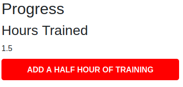

I'll now need a way to store this value in the database.

I think I should add a button to indicate that the user has finished adding to the hours rather than making a post request after each half hour added. Another option would be to provide an input to add a certain amount at one time.

I'll now add a minus 0.5 hours button (to rectify adding too many hours trained by mistake) as well as a button to save the new hours trained, which should only show after a change has been made to the initial hours trained.

<details>
<summary>> frontend/src/Progress.js<br/><br/></summary>

```jsx
// ...

class Progress extends Component {
  constructor(props) {
    super(props)
    this.state = {
      hoursTrained: 0.0,
      saveable: false,
    }
  }

  async componentDidMount() {
    const token = localStorage.getItem("auth-token")
    const response = await fetch("http://localhost:9000/progress/", {
      method: "GET",
      headers: {
        "Content-Type": "application/json",
        "auth-token": token,
      },
    })
    if (response.status === 200 || response.status === 304) {
      const data = await response.json()
      this.setState({
        hoursTrained: data.hoursTrained,
      })
    }
  }

  addHalfHourTraining() {
    this.setState({
      hoursTrained: this.state.hoursTrained + 0.5,
      saveable: true,
    })
  }

  minusHalfHourTraining() {
    // stop hours trained from being negative
    if (this.state.hoursTrained - 0.5 < 0) {
      return
    }
    this.setState({
      hoursTrained: this.state.hoursTrained - 0.5,
      saveable: true,
    })
  }

  async saveHoursTrainedToDatabase() {
    const token = localStorage.getItem("auth-token")
    const body = {}
    body.hoursTrained = this.state.hoursTrained
    const response = await fetch("http://localhost:9000/progress/train", {
      method: "POST",
      headers: {
        "Content-Type": "application/json",
        "auth-token": token,
      },
      body: JSON.stringify(body),
    })
    if (response.status === 200) {
      this.setState({
        saveable: false,
      })
    }
  }

  render() {
    return (
      <ProgressWrapper>
        // ...
        <Button onClick={this.addHalfHourTraining.bind(this)}>
          + 0.5 hours
        </Button>
        <Button onClick={this.minusHalfHourTraining.bind(this)}>
          - 0.5 hours
        </Button>
        {this.state.saveable ? <Button onClick={this.saveHoursTrainedToDatabase.bind(this)}>Save changes to hours trained</Button> : null}
      </ProgressWrapper>
    )
  }
}

// ...
```

</details>

I'd like to display the total hours trained this month, this year, last month, last year, and the user's personal record for most hours in a month and year. I think the last two are more involved and less essential so I'll leave them until after the basic app functionality is setup.

The frontend code for this solution has a little bit too much duplication.

<details>
<summary>> frontend/src/Progress.js</summary>

```jsx
// ...

class Progress extends Component {
  constructor(props) {
    super(props)
    this.state = {
      hoursTrainedThisMonth: 0.0,
      hoursTrainedThisYear: 0.0,
      hoursTrainedLastMonth: 0.0,
      hoursTrainedLastYear: 0.0,
      saveable: false,
    }
  }

  componentDidMount() {
    this.getHoursTrainedThisMonth()
    this.getHoursTrainedLastMonth()
    this.getHoursTrainedThisYear()
    this.getHoursTrainedLastYear()
  }

  async getHoursTrainedThisMonth() {
    const month = new Date().getMonth()
    const token = localStorage.getItem("auth-token")
    const response = await fetch(
      `http://localhost:9000/progress/month/${month}`,
      {
        method: "GET",
        headers: {
          "Content-Type": "application/json",
          "auth-token": token,
        },
      }
    )
    if (response.status === 200 || response.status === 304) {
      const data = await response.json()
      this.setState({
        hoursTrainedThisMonth: parseFloat(data),
      })
    }
  }

  async getHoursTrainedLastMonth() {
    const month = new Date().getMonth() - 1
    const token = localStorage.getItem("auth-token")
    const response = await fetch(
      `http://localhost:9000/progress/month/${month}`,
      {
        method: "GET",
        headers: {
          "Content-Type": "application/json",
          "auth-token": token,
        },
      }
    )
    if (response.status === 200 || response.status === 304) {
      const data = await response.json()
      this.setState({
        hoursTrainedLastMonth: data,
      })
    }
  }

  async getHoursTrainedLastYear() {
    const year = new Date().getFullYear() - 1
    const token = localStorage.getItem("auth-token")
    const response = await fetch(
      `http://localhost:9000/progress/year/${year}`,
      {
        method: "GET",
        headers: {
          "Content-Type": "application/json",
          "auth-token": token,
        },
      }
    )
    if (response.status === 200 || response.status === 304) {
      const data = await response.json()
      this.setState({
        hoursTrainedLastYear: data,
      })
    }
  }

  async getHoursTrainedThisYear() {
    const year = new Date().getFullYear()
    const token = localStorage.getItem("auth-token")
    const response = await fetch(
      `http://localhost:9000/progress/year/${year}`,
      {
        method: "GET",
        headers: {
          "Content-Type": "application/json",
          "auth-token": token,
        },
      }
    )
    if (response.status === 200 || response.status === 304) {
      const data = await response.json()
      this.setState({
        hoursTrainedThisYear: data,
      })
    }
  }

  addHalfHourTraining() {
    this.setState({
      hoursTrainedThisMonth: this.state.hoursTrainedThisMonth + 0.5,
      // ...
    })
  }

  minusHalfHourTraining() {
    // stop hours trained from being negative
    if (this.state.hoursTrainedThisMonth - 0.5 < 0) {
      return
    }
    this.setState({
      hoursTrainedThisMonth: this.state.hoursTrainedThisMonth - 0.5,
      // ...
    })
  }

  async saveHoursTrainedToDatabase() {
    const token = localStorage.getItem("auth-token")
    const body = {}
    body.hoursTrained = this.state.hoursTrainedThisMonth
    const response = await fetch("http://localhost:9000/progress/new", {
      method: "POST",
      headers: {
        "Content-Type": "application/json",
        "auth-token": token,
      },
      body: JSON.stringify(body),
    })
    if (response.status === 200) {
      this.setState({
        saveable: false,
      })
      this.componentDidMount()
    }
  }

  render() {
    return (
      <ProgressWrapper>
        <header>
          <h2>Progress</h2>
        </header>
        <div>
          <h3>Hours trained this month</h3>
          // ...
        </div>
        <div>
          <h3>Hours trained this year</h3>
          <span>{this.state.hoursTrainedThisYear}</span>
        </div>
        <div>
          <h3>Hours trained last month</h3>
          <span>{this.state.hoursTrainedLastMonth}</span>
        </div>
        <div>
          <h3>Hours trained last year</h3>
          <span>{this.state.hoursTrainedLastYear}</span>
        </div>
      </ProgressWrapper>
    )
  }
}

// ...
```

</details>

I'll now move on to the backend logic and setup the Model and Controller for Progress. I'll check to see what is the best MongoDB type to store hours trained:

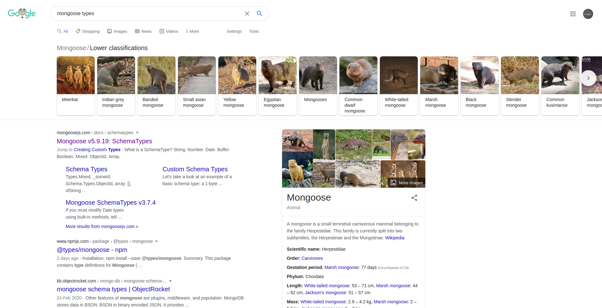

I'm not sure any of those match my use case so I'll check out the MongooseJS docs.

There is a Decimal128 type but I think my use case is simple enough that I could store the value as a String and parse it on the frontend.

<details>
<summary>> backend/models/progress<br/><br/></summary>

```jsx
const mongoose = require("mongoose")
const Schema = mongoose.Schema

const ProgressSchema = new Schema({
  hoursTrained: { type: String, required: true },
  user: { type: Schema.Types.ObjectId, ref: "User", required: true },
  date: { type: Date, default: new Date(), required: true },
})

// virtual for Progress entry month and year
// months are indexed 0-11
ProgressSchema.virtual("month").get(function () {
  return new Date(this.date).getMonth()
})

ProgressSchema.virtual("year").get(function () {
  return new Date(this.date).getFullYear()
})

module.exports = mongoose.model("Progress", ProgressSchema)
```

</details>

I'll show where the new Progress related files were added and then delve into the details of each.

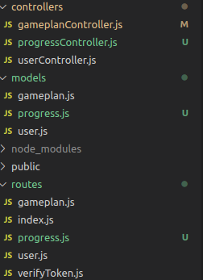

<details>
<summary>> routes/progress.js</summary>

```jsx
const express = require("express")
const router = express.Router()
const verify = require("./verifyToken")
const progress_controller = require("../controllers/progressController")

// POST request for storing hours trained
router.post("/new", verify, progress_controller.progress_create_post)

// GET request for hours trained in a given month
router.get("/month/:id", verify, progress_controller.progress_month_get)

// GET request for hours trained in a given year
router.get("/year/:id", verify, progress_controller.progress_year_get)

module.exports = router
```

</details>

<details>
<summary>> controllers/progressController.js<br/><br/></summary>

```jsx
const Progress = require("../models/progress")
const validator = require("express-validator")

// list of total hours trained by month
exports.progress_month_get = function (req, res) {
  Progress.find({ user: req.user._id }).exec(function (err, hours_list) {
    if (err) {
      return next(err)
    }
    const hours = hours_list
      .filter(
        hoursEntry => parseInt(hoursEntry.month) === parseInt(req.params.id)
      )
      .map(hoursEntry => {
        return {
          hoursTrained: hoursEntry.hoursTrained,
          date: hoursEntry.date,
        }
      })
    if (hours.length > 0) {
      res.json(hours[hours.length - 1].hoursTrained)
    } else {
      res.json(0)
    }
  })
}

// list of total hours trained by year
exports.progress_year_get = function (req, res) {
  Progress.find({ user: req.user._id }).exec(function (err, hours_list) {
    if (err) {
      return next(err)
    }
    const hours = hours_list
      .filter(
        hoursEntry => parseInt(hoursEntry.year) === parseInt(req.params.id)
      )
      .map(hoursEntry => {
        return {
          hoursTrained: hoursEntry.hoursTrained,
          date: hoursEntry.date,
        }
      })
    if (hours.length > 0) {
      res.json(hours[hours.length - 1].hoursTrained)
    } else {
      res.json(0)
    }
  })
}

// handle progress create on POST
exports.progress_create_post = [
  // sanitize all fields
  validator.sanitizeBody("*").escape(),
  // process request after validation and sanitization
  function (req, res, next) {
    const progress = new Progress({
      hoursTrained: req.body.hoursTrained,
      user: req.user._id,
    }).save(err => {
      if (err) {
        return next(err)
      }
      res.sendStatus(200)
    })
  },
]
```

</details>

The structure is very similar to the routes setup for GETting and POSTing with the Gameplan data.

A small change is also required in app.js:

```jsx
// ...
const progressRouter = require("./routes/progress")
// ...
app.use("/progress", progressRouter)
// ...
```

Here's how the Progress section of the App is shaping up now:

![Part of a webpage showing a heading with the text "Progress" and 4 sub-headings. The first has the text "Hours trained this month" and below it is the number zero and a button with the text "+ 0.5 hours" and another button with the text "- 0.5 hours". The second sub-heading has the text "Hours trained this year", the third has the text "Hours trained last month" and the fourth and final sub-heading has the text "Hours trained last year". The last 3 sub-headings all have the number zero below them as well.](progress-start.png)

I'll now try incrementing the hours trained this month:


To have the hours trained this year update, the changes need to be saved to hours trained this month:


### Basic style for the Progress section

Now that the main features of the Progress section have been added I'll take a step back and work on some basic styling:

frontend/src/Progress.js

```jsx
// ...
const ProgressWrapper = styled.div`
  display: grid;
  grid-template-columns: 1fr 1fr;
  grid-auto-flow: row;
  grid-gap: 10px;

  div {
    background: #eee;
    border: 1px solid black;
    padding: 10px;
    border-radius: 5px;
  }
`
// ...
```

![Part of a webpage showing a heading with the text "Progress" and 4 sub-headings. The first has the text "Hours trained this month" and below it is the number 0.5 and a button with the text "+ 0.5 hours" and another button with the text "- 0.5 hours". The second sub-heading has the text "Hours trained this year" and has the number 0.5 below it, the third has the text "Hours trained last month" and the fourth and final sub heading has the text "Hours trained last year". The last 2 subheadings all have the number zero below them as well.](styled-progress.png)

## Notes Section

I'll make a start on the notes section now.

For this first iteration I'm going to move the notes section below the gameplan and just have all the notes displayed sequentially with new notes on the top.

As of now it will be more of a section for quick thoughts and ideas to jot down from training, or ideas for what to work on, and will lack any kind of structure such as castegorization into notes on techniques, competition mindset, specific position breakdowns etc.

<details>
<summary>> frontend/src/Progress.js<br/><br/></summary>

```jsx
import React from "react";
import { Component } from "react";
import { Button } from "./components/Button";

export class Notes extends Component {
  constructor(props) {
    super(props);
    this.state = {
      notes: [],
    };
  }

  componentDidMount() {
    this.getNotesFromDatabase();
  }

  async getNotesFromDatabase() {
    const token = localStorage.getItem("auth-token");
    const response = await fetch("http://localhost:9000/notes/", {
      method: "GET",
      headers: {
        "Content-Type": "application/json",
        "auth-token": token,
      },
    });
    if (response.status === 200 || response.status === 304) {
      const data = await response.json();
      this.setState({
        notes: data,
      });
    }
  }

  async saveNoteToDatabase(e) {
    e.preventDefault();
    e.persist();
    const content = e.target.note.value;
    const token = localStorage.getItem("auth-token");
    const body = {};
    body.content = content;
    const response = await fetch("http://localhost:9000/notes/new", {
      method: "POST",
      headers: {
        "Content-Type": "application/json",
        "auth-token": token,
      },
      body: JSON.stringify(body),
    });
    if (response.status === 200) {
      this.setState({
        saveable: false,
      });
      e.target.reset();
      this.getNotesFromDatabase();
    }
  }

  render() {
    return (
      <div>
        <header>
          <h2>Notes</h2>
        </header>
        <form
          style={{
            display: `grid`,
            gridTemplateColumns: `1fr`,
            gridGap: `10px`,
          }}
          onSubmit={this.saveNoteToDatabase.bind(this)}
        >
          <label htmlFor="note">New Note</label>
          <textarea name="note" id="note" cols="30" rows="5"></textarea>
          <Button>Save</Button>
        </form>
        this.state.notes.reverse().map((note) => {
          return (
            <div>
              <span>{note.date}</span>
              <p>{note.content}</p>
            </div>
          );
        })}
      </div>
    );
  }
}
```

</details>

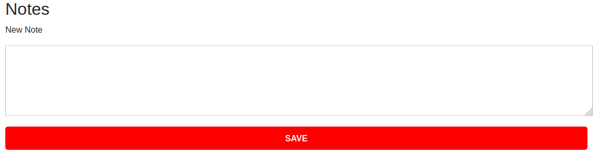

I'll move onto setting up the routes, model and controller for this section now.

backend/app.js

```jsx
// ...
const notesRouter = require("./routes/note")
// ...
app.use("/notes", notesRouter)
// ...
```

<details>
<summary>> backend/routes/note.js</summary>

```jsx
const express = require("express")
const router = express.Router()
const verify = require("./verifyToken")
const note_controller = require("../controllers/noteController")

// GET request for all notes
router.get("/", verify, note_controller.note_get)

// POST request for creating new note
router.post("/new", verify, note_controller.note_create_post)

module.exports = router
```

</details>

<details>
<summary>> backend/models/note.js</summary>

```jsx
const mongoose = require("mongoose")
const Schema = mongoose.Schema
const dateFns = require("date-fns")

const NoteSchema = new Schema({
  content: { type: String, required: true },
  user: { type: Schema.Types.ObjectId, ref: "User", required: true },
  date: { type: Date, default: new Date(), required: true },
})

// virtual for formatted date
NoteSchema.virtual("formattedDate").get(function () {
  return dateFns.format(new Date(this.date), "iii do MMM y")
})

module.exports = mongoose.model("Note", NoteSchema)
```

</details>

And of course running the following from within the backend directory:

```bash
npm install date-fns --save
```

<details>
<summary>> 
backend/controllers/noteController.js<br/><br/>
</summary>

```jsx
const Note = require("../models/note")
const validator = require("express-validator")

// all notes
exports.note_get = function (req, res) {
  Note.find({ user: req.user._id }).exec(function (err, note_list) {
    if (err) {
      return next(err)
    }
    const notes = note_list.map(note => {
      return {
        content: note.content,
        date: note.formattedDate,
      }
    })
    res.json(notes)
  })
}

// handle notes create on POST
exports.note_create_post = [
  // sanitize all fields
  validator.sanitizeBody("*").escape(),
  // process request after validation and sanitization
  function (req, res, next) {
    const note = new Note({
      content: req.body.content,
      user: req.user._id,
    }).save(err => {
      if (err) {
        return next(err)
      }
      res.sendStatus(200)
    })
  },
]
```

</details>

The folders on the backend now look like this:

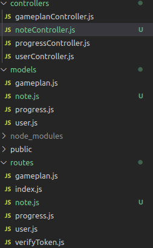

I'll now create the first note:

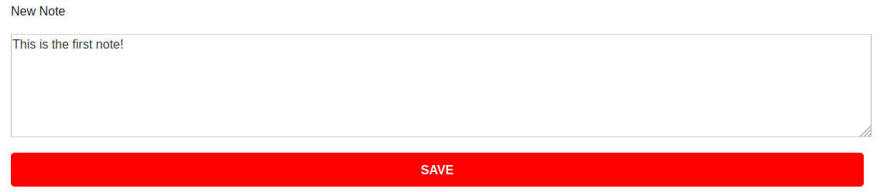 And saving it...
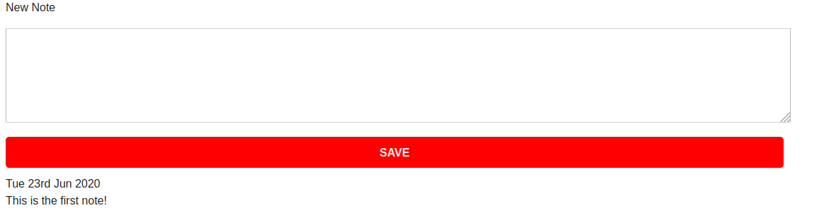

And with that, the site's basic functionality is wrapped up, there's now code for all 3 sections. The gameplan section was definitely the toughest of the lot. The Progress section was about as difficult as I thought it would be. The final Notes section was actually a lot easier and took much less time than I thought it would.

## Styling everything

Now on to some more styling...

![Part of a webpage showing a navigation bar with 3 links with the names "Progress", "Gameplan" and "Notes respectively". Below the navigation bar is a heading with the text "Progress" and 4 sub-headings. The first has the text "Hours trained this month" and below it is the number 0 and a button with the text "+ 0.5 hours" and another button with the text "- 0.5 hours". The second sub-heading has the text "Hours trained this year" and has the number 0 below it, the third has the text "Hours trained last month" and the fourth and final sub-heading has the text "Hours trained last year". The last 2 subheadings each have the number zero below them as well.](bjj-progress-app.png)

![Part of a webpage showing a heading with the text "Gameplan". There is a box with the text "Open Guard" and below that the text "Butterfly Sweep". To the right of this is a trash can icon to delete the box representing the position. Below the box and icon is a downwards arrow pointing to another box and trash can icon. This second box has the text "Side Control" and "Transition to Mount". There is another downwards arrow below this box and icon, pointing to the third box and icon. The final box has the text "Full Mount" and "Americana". At the bottom there is a plus icon to add another position box.](bjj-gameplan-app.png)


[View all code](https://github.com/barrysweeney/bjj-companion)

## Deployment

To deploy the app I'll host the backend on Heroku and the frontend on Netlify.

There are a few things to change before deployment.

I'll have an environment variable for the backend URI so I'll export that from App.js

```jsx
// ...
export const BACKEND_URI = process.env.BACKEND_URI || "http://localhost:9000"
// ...
```

And change all occurences of "http://localhost:9000" to:

```jsx
;`${BACKEND_URI}`
```

For example:

```jsx
const response = await fetch("http://localhost:9000/log-in", {
  // ...
```

will become...

```jsx
const response = await fetch(`${BACKEND_URI}/log-in`, {
  // ...
```

I'll create a new private Github repository and push the contents of the backend folder to it. This will allow me to create the Heroku app and easily setup automatic deployment from the master branch.

I'll open the Heroku dashboard and click the Create New App button and enter the name and region. I'll then connect it to the Github repositroy from the deploy tab:

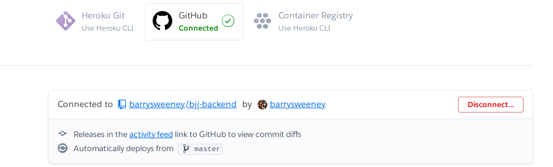

Committing the desired files and runing `git push heroku master` should have the app up and running and available on the URL that Heroku provides.

I also created a seperate private repository for the frontend and pushed the contents of the frontend folder to it. I connected this to Netlify by using the New Site from Git button on the Netlify dashboard.

I tried adding the backend URI to Netlify's environment variables but this only controls the environment the site build in and/or gets deployed to. I could have injected the environment variable values with a function and prepended the command that runs the functions to my build command but, as I'm using a private frontend repository I decided to just change the line

```jsx
export const BACKEND_URI = process.env.BACKEND_URI || "http://localhost:9000"
```

in App.js and replace `process.env.BACKEND_URI` with the actual backend URI. I also realized that injecting the variable at build time might still not effectively hide the URI as it can be seen from the network tab of the developer console.

## Conclusion

As I learn more and find the personal need, I'll likely go back and add more features, cleaning up the code as I go. When I have some more experience under my belt I'd also like to add tests.